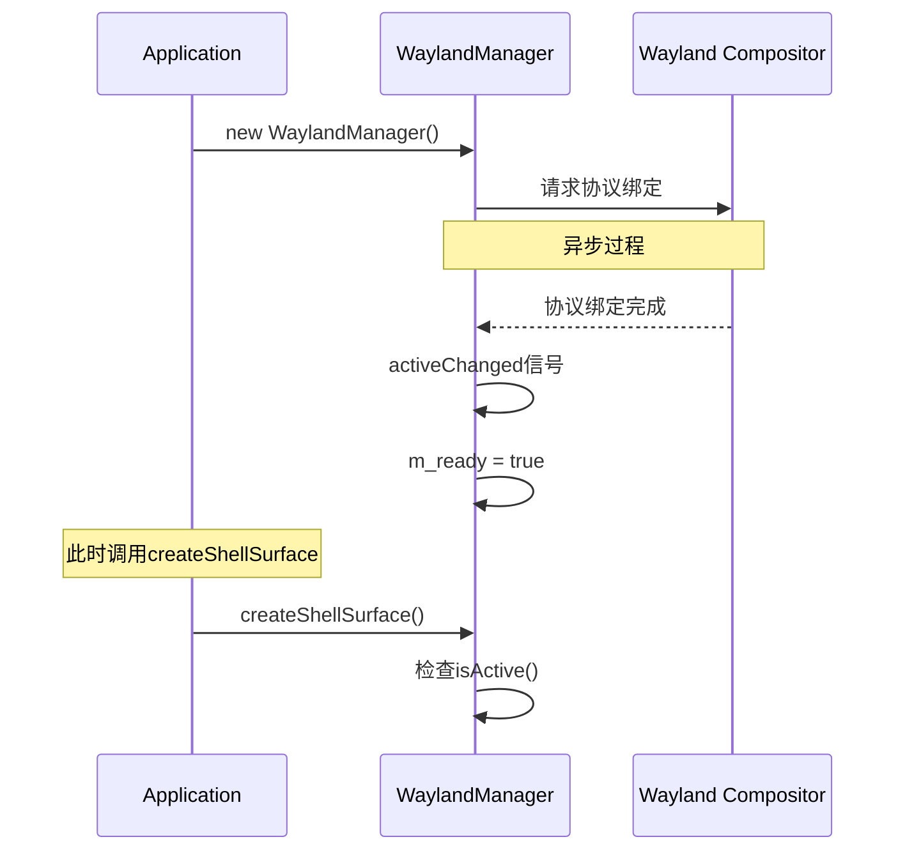

# createShellSurface 失败原因分析报告

## 问题描述

在 `examples/test_skip_multitaskview_window/window.cpp:76-80` 中，`s_waylandManager->createShellSurface(surface)` 调用返回 null 值，导致 shell surface 创建失败。

## 代码分析

### 问题代码段
```cpp
// window.cpp:76-80
m_shellSurface = s_waylandManager->createShellSurface(surface);
if (!m_shellSurface) {
    qWarning() << "Failed to create shell surface";
    return false;
}
```

### 失败路径分析

在 `WaylandManager::createShellSurface()` 中存在两个主要失败点：

```cpp
ShellSurface *WaylandManager::createShellSurface(struct wl_surface *surface)
{
    // 失败点1：协议未激活
    if (!isActive()) {
        return nullptr;
    }

    // 失败点2：协议调用失败
    auto *shellSurface = get_shell_surface(surface);
    if (!shellSurface) {
        return nullptr;
    }

    return new ShellSurface(shellSurface, this);
}
```

## 可能的失败原因

### 1. Wayland 协议未激活 (!isActive())

**根本原因：**
- `treeland-dde-shell-v1` 协议未被 Wayland compositor 支持
- 协议注册需要时间，在协议完全激活前就被调用
- WaylandManager 继承自 `QWaylandClientExtensionTemplate`，需要等待服务端协议绑定

**时机问题：**
```cpp
// window.cpp:24-26
if (!s_waylandManager) {
    s_waylandManager = new WaylandManager(qApp);
}
// 立即调用，可能协议尚未激活
```

**激活流程：**


### 2. get_shell_surface() 协议调用失败

**可能原因：**
- **Compositor 不支持**：运行环境的 compositor 不支持 treeland-dde-shell-v1 协议
- **协议版本不匹配**：客户端和服务端协议版本不兼容
- **资源限制**：Compositor 资源不足，无法创建新的 shell surface
- **Surface 状态问题**：传入的 wl_surface 无效或状态不正确

### 3. 环境和时机问题

**运行环境：**
- 必须在支持 treeland-dde-shell-v1 的 compositor 下运行
- 通常需要 Treeland compositor 或其他兼容实现

**初始化时机：**
- Window.show() 后立即调用可能过早
- 需要确保 Wayland 连接和协议都已就绪

## 调试方法

### 1. 添加详细日志

```cpp
ShellSurface *WaylandManager::createShellSurface(struct wl_surface *surface)
{
    qDebug() << "createShellSurface: isActive()=" << isActive() 
             << ", version=" << version()
             << ", surface=" << surface;
             
    if (!isActive()) {
        qWarning() << "treeland-dde-shell-v1 protocol not active yet";
        return nullptr;
    }

    auto *shellSurface = get_shell_surface(surface);
    if (!shellSurface) {
        qWarning() << "get_shell_surface() failed - compositor may not support the protocol";
        return nullptr;
    }

    qDebug() << "Successfully created shell surface:" << shellSurface;
    return new ShellSurface(shellSurface, this);
}
```

### 2. 检查协议支持

```cpp
// 在 WaylandManager 构造函数中添加
WaylandManager::WaylandManager(QObject *parent)
    : QWaylandClientExtensionTemplate<WaylandManager>(1)
{
    connect(this, &QWaylandClientExtension::activeChanged, [this]() {
        qDebug() << "treeland-dde-shell-v1 protocol activeChanged:" << isActive();
        if (isActive()) {
            qDebug() << "Protocol version:" << version();
        }
    });
}
```

### 3. 环境诊断

```bash
# 检查当前 compositor
echo $XDG_SESSION_TYPE
echo $WAYLAND_DISPLAY

# 检查 Wayland 协议支持
wayland-info | grep treeland

# 运行时调试
WAYLAND_DEBUG=1 ./test_skip_multitaskview_window
```

## 解决方案

### 1. 异步等待协议激活

```cpp
Window *Window::get(QWindow *window)
{
    if (!window) {
        qWarning() << "Window::get: window is null";
        return nullptr;
    }

    Window *&it = s_windows[window];
    if (!it) {
        if (!s_waylandManager) {
            s_waylandManager = new WaylandManager(qApp);
        }

        it = new Window(window);
        
        // 如果协议未激活，等待激活后再初始化
        if (!s_waylandManager->isReady()) {
            connect(s_waylandManager, &WaylandManager::ready, it, [it]() {
                if (!it->initialize()) {
                    qWarning() << "Failed to initialize window after protocol ready";
                }
            });
        } else {
            if (!it->initialize()) {
                delete it;
                it = nullptr;
                return nullptr;
            }
        }
    }
    return it;
}
```

### 2. 重试机制

```cpp
class Window : public QObject
{
private:
    QTimer *m_retryTimer = nullptr;
    int m_retryCount = 0;
    static const int MAX_RETRIES = 5;
    
public:
    void initializeWithRetry() {
        if (initialize()) {
            return; // 成功
        }
        
        if (m_retryCount < MAX_RETRIES) {
            if (!m_retryTimer) {
                m_retryTimer = new QTimer(this);
                m_retryTimer->setSingleShot(true);
                connect(m_retryTimer, &QTimer::timeout, this, &Window::initializeWithRetry);
            }
            
            m_retryCount++;
            int delay = 100 * m_retryCount; // 递增延迟
            qDebug() << "Retrying initialization in" << delay << "ms, attempt" << m_retryCount;
            m_retryTimer->start(delay);
        } else {
            qWarning() << "Failed to initialize after" << MAX_RETRIES << "attempts";
        }
    }
};
```

### 3. 降级处理

```cpp
bool Window::setSkipMultitaskview(bool skip)
{
    if (!m_shellSurface) {
        qWarning() << "Window::setSkipMultitaskview: shell surface not initialized";
        qDebug() << "Attempting to initialize shell surface...";
        
        // 尝试重新初始化
        if (initialize()) {
            return setSkipMultitaskview(skip);
        }
        
        // 降级处理：记录状态，待以后设置
        m_pendingSkipMultitaskview = skip;
        m_hasPendingSkipMultitaskview = true;
        qDebug() << "Stored skip multitaskview setting for later application";
        return false;
    }

    m_shellSurface->setSkipMultitaskview(skip);
    qDebug() << "Successfully set skip multitaskview to" << skip;
    return true;
}
```

## 建议的改进优先级

1. **高优先级**：实现异步等待协议激活机制
2. **中优先级**：添加详细的错误日志和诊断信息  
3. **低优先级**：实现重试机制和降级处理

## 测试建议

1. 在 Treeland compositor 环境下测试
2. 在不支持协议的 compositor 下测试降级行为
3. 测试快速创建多个窗口的场景
4. 验证协议激活的时机和信号

这个分析报告详细解释了 createShellSurface 失败的可能原因，并提供了具体的调试方法和解决方案。
