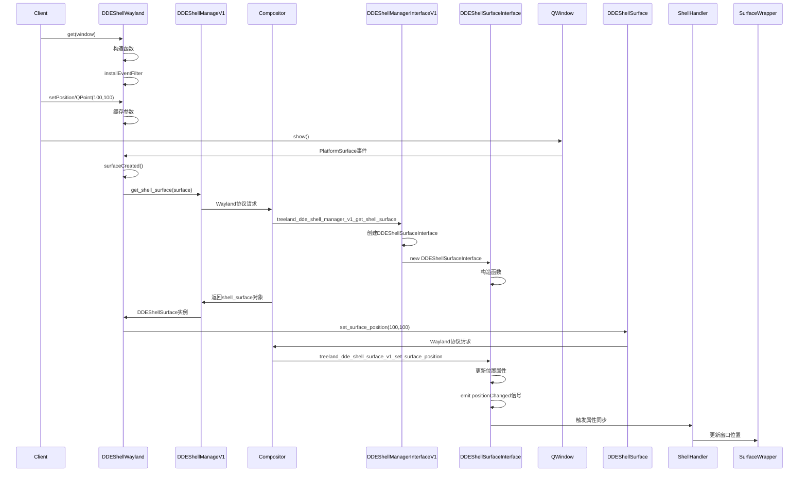

# DDEShellSurfaceInterface 客户端集成指南

## 概述

本文档详细说明客户端如何通过 Wayland 协议调用 `DDEShellSurfaceInterface` 相关功能，包括完整的调用流程、代码示例、依赖关系和使用场景。

## 1. Wayland 协议基础

### 协议文件分析

DDEShellSurfaceInterface 基于 `treeland-dde-shell-v1.xml` 协议：

```xml
<interface name="treeland_dde_shell_manager_v1" version="1">
    <request name="get_shell_surface" since="1">
        <description summary="create a shell surface from a surface">
            Create a shell surface for an existing wl_surface.
        </description>
        <arg name="id" type="new_id" interface="treeland_dde_shell_surface_v1"/>
        <arg name="surface" type="object" interface="wl_surface"/>
    </request>
</interface>

<interface name="treeland_dde_shell_surface_v1" version="1">
    <request name="set_surface_position" since="1">
        <arg name="x" type="int" summary="x coordinate in global space"/>
        <arg name="y" type="int" summary="y coordinate in global space"/>
    </request>

    <enum name="role">
        <entry name="overlay" value="1" since="1"/>
    </enum>

    <request name="set_role" since="1">
        <arg name="role" type="uint" enum="treeland_dde_shell_surface_v1.role"/>
    </request>

    <!-- 其他请求... -->
</interface>
```

## 2. 客户端架构

### 核心组件

#### DDEShellManageV1 类
```cpp
class DDEShellManageV1
    : public QWaylandClientExtensionTemplate<DDEShellManageV1>
    , public QtWayland::treeland_dde_shell_manager_v1
{
public:
    DDEShellManageV1()
        : QWaylandClientExtensionTemplate<DDEShellManageV1>(1) // 版本1
    {
        initialize();
    }
};
```

#### DDEShellSurface 类
```cpp
class DDEShellSurface : public QtWayland::treeland_dde_shell_surface_v1
{
public:
    DDEShellSurface(struct ::treeland_dde_shell_surface_v1 *id)
        : QtWayland::treeland_dde_shell_surface_v1(id)
    {}

    ~DDEShellSurface() {
        destroy();
    }
};
```

#### DDEShellWayland 管理类
```cpp
class DDEShellWayland : public QObject
{
public:
    static DDEShellWayland *get(QWindow *window);

    void setPosition(const QPoint &position);
    void setRole(QtWayland::treeland_dde_shell_surface_v1::role role);
    void setAutoPlacement(int32_t yOffset);
    void setSkipSwitcher(uint32_t skip);
    void setSkipDockPreview(uint32_t skip);
    void setSkipMutiTaskView(uint32_t skip);
    void setAcceptKeyboardFocus(uint32_t accept);
};
```

## 3. 客户端调用流程

### 完整调用流程图



### 详细步骤说明

#### 步骤1：初始化管理器
```cpp
// 全局单例模式
class ShellIntegrationSingleton {
public:
    std::unique_ptr<DDEShellManageV1> shellManager;
    QHash<QWindow *, DDEShellWayland *> windows;
};

ShellIntegrationSingleton::ShellIntegrationSingleton() {
    shellManager = std::make_unique<DDEShellManageV1>();
}
```

#### 步骤2：为窗口创建DDEShellWayland实例
```cpp
DDEShellWayland *DDEShellWayland::get(QWindow *window) {
    DDEShellWayland *&it = s_waylandIntegration->windows[window];
    if (!it) {
        it = new DDEShellWayland(window);
    }
    return it;
}
```

#### 步骤3：设置窗口属性
```cpp
// 设置位置
DDEShellWayland::get(window)->setPosition(QPoint(100, 100));

// 设置角色
DDEShellWayland::get(window)->setRole(
    QtWayland::treeland_dde_shell_surface_v1::role_overlay);

// 设置自动放置
DDEShellWayland::get(window)->setAutoPlacement(30);

// 设置跳过属性
DDEShellWayland::get(window)->setSkipSwitcher(true);
DDEShellWayland::get(window)->setSkipDockPreview(true);
DDEShellWayland::get(window)->setSkipMutiTaskView(true);

// 设置键盘焦点
DDEShellWayland::get(window)->setAcceptKeyboardFocus(false);
```

#### 步骤4：显示窗口触发协议调用
```cpp
void DDEShellWayland::surfaceCreated() {
    // 获取Wayland surface
    struct wl_surface *surface = waylandWindow->surface();

    // 创建shell surface
    m_shellSurface = std::make_unique<DDEShellSurface>(
        s_waylandIntegration->shellManager->get_shell_surface(surface));

    // 应用缓存的设置
    if (m_position) {
        m_shellSurface->set_surface_position(m_position->x(), m_position->y());
    }
    if (m_role) {
        m_shellSurface->set_role(m_role.value());
    }
    // ... 其他属性设置
}
```

## 4. 服务端处理流程

### DDEShellManagerInterfaceV1 处理

```cpp
void DDEShellManagerInterfaceV1Private::treeland_dde_shell_manager_v1_get_shell_surface(
    Resource *resource,
    uint32_t id,
    wl_resource *surface)
{
    // 验证surface
    if (!surface) {
        wl_resource_post_error(resource->handle, 0, "surface resource is NULL!");
        return;
    }

    // 检查是否已存在
    if (DDEShellSurfaceInterface::get(surface)) {
        wl_resource_post_error(resource->handle, 0,
                              "treeland_dde_shell_surface_v1 already exists");
        return;
    }

    // 创建Wayland资源
    wl_resource *shell_resource = wl_resource_create(resource->client(),
                                                     &treeland_dde_shell_surface_v1_interface,
                                                     resource->version(),
                                                     id);

    // 创建服务端对象
    auto shellSurface = new DDEShellSurfaceInterface(surface, shell_resource);

    // 管理生命周期
    s_shellSurfaces.append(shellSurface);
    QObject::connect(shellSurface, &QObject::destroyed, [shellSurface]() {
        s_shellSurfaces.removeOne(shellSurface);
    });

    // 发送信号
    Q_EMIT q->surfaceCreated(shellSurface);
}
```

### DDEShellSurfaceInterface 属性处理

```cpp
void DDEShellSurfaceInterfacePrivate::treeland_dde_shell_surface_v1_set_surface_position(
    Resource *resource,
    int32_t x,
    int32_t y)
{
    QPoint pos(x, y);

    if (surfacePos == pos) {
        return; // 避免不必要的更新
    }

    surfacePos = pos;
    Q_EMIT q->positionChanged(pos); // 触发信号
}
```

## 5. ShellHandler 集成

### 信号连接和属性同步

```cpp
void ShellHandler::handleDdeShellSurfaceAdded(WSurface *surface, SurfaceWrapper *wrapper) {
    wrapper->setIsDDEShellSurface(true);
    auto ddeShellSurface = DDEShellSurfaceInterface::get(surface);

    // 角色处理
    auto updateLayer = [ddeShellSurface, wrapper] {
        if (ddeShellSurface->role().value() ==
            DDEShellSurfaceInterface::OVERLAY) {
            wrapper->setSurfaceRole(SurfaceWrapper::SurfaceRole::Overlay);
        }
    };

    if (ddeShellSurface->role().has_value()) {
        updateLayer();
    }

    // 连接信号以同步属性变化
    connect(ddeShellSurface, &DDEShellSurfaceInterface::roleChanged,
            this, [updateLayer] { updateLayer(); });

    // 位置同步
    if (ddeShellSurface->surfacePos().has_value()) {
        wrapper->setClientRequstPos(ddeShellSurface->surfacePos().value());
    }

    connect(ddeShellSurface, &DDEShellSurfaceInterface::positionChanged,
            this, [wrapper](QPoint pos) {
                wrapper->setClientRequstPos(pos);
            });

    // 其他属性同步...
}
```

## 6. 错误处理

### 客户端错误处理

```cpp
void DDEShellWayland::surfaceCreated() {
    // 检查管理器是否激活
    if (!s_waylandIntegration->shellManager ||
        !s_waylandIntegration->shellManager->isActive()) {
        return; // 静默失败，协议不可用
    }

    // 获取surface
    struct wl_surface *surface = nullptr;
    if (auto waylandWindow = m_window->nativeInterface<...>()) {
        surface = waylandWindow->surface();
    }

    if (!surface) {
        return; // 没有有效的surface
    }

    // 创建shell surface
    m_shellSurface = std::make_unique<DDEShellSurface>(
        s_waylandIntegration->shellManager->get_shell_surface(surface));

    // 检查创建是否成功
    if (!m_shellSurface) {
        qWarning() << "Failed to create DDEShellSurface";
        return;
    }

    // 应用设置...
}
```

### 服务端错误处理

```cpp
// 重复创建检查
if (DDEShellSurfaceInterface::get(surface)) {
    wl_resource_post_error(resource->handle, 0,
                          "treeland_dde_shell_surface_v1 already exists");
    return;
}

// 内存分配失败
wl_resource *shell_resource = wl_resource_create(...);
if (!shell_resource) {
    wl_client_post_no_memory(resource->client());
    return;
}

// 无效角色值
switch (value) {
case QtWaylandServer::treeland_dde_shell_surface_v1::role::role_overlay:
    newRole = DDEShellSurfaceInterface::OVERLAY;
    break;
default:
    wl_resource_post_error(resource->handle, 0,
                          "Invalid treeland_dde_shell_surface_v1::role: %u", value);
    return;
}
```

## 7. 完整使用示例

### 基本使用示例

```cpp
#include "ddeshellwayland.h"
#include <QApplication>
#include <QWidget>

int main(int argc, char *argv[]) {
    qputenv("QT_QPA_PLATFORM", "wayland");
    QApplication app(argc, argv);

    QWidget window;
    window.setWindowTitle("DDE Shell Surface Example");
    window.resize(400, 300);

    // 获取DDEShellWayland实例
    DDEShellWayland *ddeShell = DDEShellWayland::get(window.windowHandle());

    // 设置为覆盖层
    ddeShell->setRole(QtWayland::treeland_dde_shell_surface_v1::role_overlay);

    // 设置位置
    ddeShell->setPosition(QPoint(100, 100));

    // 设置跳过任务切换器
    ddeShell->setSkipSwitcher(true);

    // 显示窗口
    window.show();

    return app.exec();
}
```

### 高级使用示例

```cpp
class OverlayWidget : public QWidget {
public:
    OverlayWidget(QWidget *parent = nullptr) : QWidget(parent) {
        setupDdeShell();
    }

private:
    void setupDdeShell() {
        DDEShellWayland *ddeShell = DDEShellWayland::get(windowHandle());

        // 配置覆盖层属性
        ddeShell->setRole(QtWayland::treeland_dde_shell_surface_v1::role_overlay);
        ddeShell->setSkipSwitcher(true);
        ddeShell->setSkipDockPreview(true);
        ddeShell->setSkipMutiTaskView(true);
        ddeShell->setAcceptKeyboardFocus(false);

        // 使用自动放置
        ddeShell->setAutoPlacement(20); // 距离光标底部20px
    }
};
```

## 8. 依赖关系

### 客户端依赖

- **QtWayland**: 提供Wayland客户端支持
- **qwayland-treeland-dde-shell-v1.h**: 协议绑定头文件
- **QWindow**: Qt窗口系统
- **wl_surface**: Wayland surface

### 服务端依赖

- **DDEShellManagerInterfaceV1**: 管理器接口
- **DDEShellSurfaceInterface**: Shell surface接口
- **ShellHandler**: 窗口管理器
- **WSurface**: Wayland surface包装
- **SurfaceWrapper**: 窗口包装器

## 9. 最佳实践

### 1. 生命周期管理
- 在窗口显示前设置所有属性
- 正确处理窗口销毁时的清理
- 使用智能指针管理资源

### 2. 错误处理
- 检查协议是否可用
- 处理surface创建失败
- 验证参数有效性

### 3. 性能优化
- 缓存设置避免重复调用
- 使用信号连接进行属性同步
- 避免频繁的位置更新

### 4. 兼容性
- 检查协议版本支持
- 处理协议不可用的情况
- 提供降级方案

## 10. 调试和故障排除

### 常见问题

1. **协议不可用**
   ```cpp
   if (!s_waylandIntegration->shellManager->isActive()) {
       qWarning() << "DDE Shell protocol not available";
       return;
   }
   ```

2. **Surface创建失败**
   ```cpp
   if (!m_shellSurface) {
       qWarning() << "Failed to create shell surface";
       return;
   }
   ```

3. **属性设置无效**
   - 确保在surface创建后设置属性
   - 检查参数值是否有效
   - 验证协议版本支持

### 调试技巧

- 使用 `WAYLAND_DEBUG=1` 环境变量查看协议消息
- 检查Qt日志输出
- 验证surface生命周期
- 监控信号发射

这个指南提供了完整的客户端集成流程，帮助开发者正确使用DDEShellSurfaceInterface的功能。
