# DDEShellManagerInterfaceV1 和 m_ddeShellV1 详细分析报告

## 1. m_ddeShellV1 变量分析

### 1.1 定义和声明
- **位置**: `compositor/src/seat/helper.h:359`
- **类型**: `DDEShellManagerInterfaceV1 *`
- **初始值**: `nullptr`
- **作用域**: Helper 类的私有成员变量

### 1.2 初始化
- **位置**: `compositor/src/seat/helper.cpp:903`
- **代码**: `m_ddeShellV1 = m_server->attach<DDEShellManagerInterfaceV1>();`
- **上下文**: 在 `Helper::init()` 方法中，作为 Wayland 服务器初始化的一部分
- **时机**: 在服务器启动后，协议管理器创建之前

### 1.3 使用和调用关系

#### 1.3.1 信号连接
```cpp
// 多任务视图切换
connect(m_ddeShellV1, &DDEShellManagerInterfaceV1::toggleMultitaskview, this, [this] {
    if (m_multitaskView) {
        m_multitaskView->toggleMultitaskView(IMultitaskView::ActiveReason::ShortcutKey);
    }
});

// 窗口选择器请求
connect(m_ddeShellV1, &DDEShellManagerInterfaceV1::requestPickWindow, this, &Helper::handleWindowPicker);

// 锁屏界面创建 (条件编译)
#ifndef DISABLE_DDM
connect(m_ddeShellV1, &DDEShellManagerInterfaceV1::lockScreenCreated, this, &Helper::handleLockScreen);
#endif
```

#### 1.3.2 拖拽事件处理
- **位置**: `compositor/src/seat/helper.cpp:1769-1780`
- **用途**: 处理拖拽开始和结束事件，向 DDE 客户端发送活动状态通知

```cpp
if (m_ddeShellV1) {
    DDEActiveInterface::sendDrop(m_seat);  // 拖拽结束
    DDEActiveInterface::sendStartDrag(m_seat);  // 拖拽开始
}
```

#### 1.3.3 输入事件处理
- **位置**: `compositor/src/seat/helper.cpp:2103, 2116`
- **断言**: `Q_ASSERT(m_ddeShellV1 && m_seat);`
- **用途**: 确保 DDE Shell 管理器已初始化后再处理鼠标和滚轮事件

#### 1.3.4 依赖关系
- **依赖于**: `WServer` 实例 (`m_server`)
- **被依赖于**: 多个事件处理器和信号槽连接
- **生命周期**: 与 Helper 对象相同，从初始化到销毁

## 2. DDEShellManagerInterfaceV1 类分析

### 2.1 类结构
```cpp
class DDEShellManagerInterfaceV1 : public QObject, public WServerInterface
{
    Q_OBJECT
public:
    explicit DDEShellManagerInterfaceV1(QObject *parent = nullptr);
    ~DDEShellManagerInterfaceV1() override;

    void checkRegionalConflict(const QRegion &region);

Q_SIGNALS:
    void surfaceCreated(DDEShellSurfaceInterface *interface);
    void activeCreated(DDEActiveInterface *interface);
    void windowOverlapCheckerCreated(WindowOverlapCheckerInterface *interface);
    void multiTaskViewsCreated(MultiTaskViewInterface *interface);
    void PickerCreated(WindowPickerInterface *picker);
    void lockScreenCreated(LockScreenInterface *interface);
    void toggleMultitaskview();
    void requestPickWindow(WindowPickerInterface *picker);

protected:
    void create(WServer *server) override;
    void destroy(WServer *server) override;
    wl_global *global() const override;
    QByteArrayView interfaceName() const override;

private:
    std::unique_ptr<DDEShellManagerInterfaceV1Private> d;
};
```

### 2.2 主要职责
- **协议管理**: 实现 Treeland DDE Shell v1 Wayland 协议
- **接口创建**: 为客户端提供各种 DDE Shell 相关接口
- **事件分发**: 将客户端请求转发给相应的处理器
- **生命周期管理**: 管理所有子接口的创建和销毁

### 2.3 子接口类详细分析

#### 2.3.1 DDEShellSurfaceInterface
**用途**: 管理 DDE Shell 表面的属性和行为

**主要函数**:
- `set_surface_position(int32_t x, int32_t y)` - 设置表面位置
- `set_role(uint32_t value)` - 设置表面角色 (OVERLAY)
- `set_auto_placement(uint32_t y_offset)` - 设置自动放置偏移
- `set_skip_switcher(uint32_t skip)` - 跳过任务切换器
- `set_skip_dock_preview(uint32_t skip)` - 跳过 dock 预览
- `set_skip_muti_task_view(uint32_t skip)` - 跳过多任务视图
- `set_accept_keyboard_focus(uint32_t accept)` - 设置是否接受键盘焦点

**信号**:
- `positionChanged(QPoint pos)`
- `roleChanged(DDEShellSurfaceInterface::Role role)`
- `yOffsetChanged(uint32_t offset)`
- `skipSwitcherChanged(bool skip)`
- `skipDockPreViewChanged(bool skip)`
- `skipMutiTaskViewChanged(bool skip)`
- `acceptKeyboardFocusChanged(bool accept)`

#### 2.3.2 DDEActiveInterface
**用途**: 处理用户活动状态通知

**主要函数**:
- `sendActiveIn(uint32_t reason)` - 发送活动进入通知
- `sendActiveOut(uint32_t reason)` - 发送活动退出通知
- `sendStartDrag()` - 发送拖拽开始通知
- `sendDrop()` - 发送拖拽结束通知

**活动原因枚举**:
- `Mouse = 0` - 鼠标活动
- `Wheel = 1` - 滚轮活动

#### 2.3.3 WindowOverlapCheckerInterface
**用途**: 检查窗口重叠冲突

**主要函数**:
- `update(int32_t width, int32_t height, uint32_t anchor, wl_resource *output)` - 更新检查区域
- `sendOverlapped(bool overlapped)` - 发送重叠状态

**锚点枚举**:
- `TOP = 1`
- `BOTTOM = 2`
- `LEFT = 4`
- `RIGHT = 8`

#### 2.3.4 MultiTaskViewInterface
**用途**: 管理多任务视图切换

**主要函数**:
- `toggle()` - 切换多任务视图

**信号**:
- `toggle()`

#### 2.3.5 WindowPickerInterface
**用途**: 处理窗口选择功能

**主要函数**:
- `pick(const QString &hint)` - 发起窗口选择
- `sendWindowPid(qint32 pid)` - 发送选定窗口的 PID

**信号**:
- `pick(const QString &hint)`
- `beforeDestroy()`

#### 2.3.6 LockScreenInterface
**用途**: 管理锁屏功能

**主要函数**:
- `lock()` - 锁定屏幕
- `shutdown()` - 关机
- `switchUser()` - 切换用户

**信号**:
- `lock()`
- `shutdown()`
- `switchUser()`

## 3. 调用关系图

```mermaid
graph TD
    A[Helper::init] --> B[m_ddeShellV1 = m_server->attach<DDEShellManagerInterfaceV1>]
    B --> C[DDEShellManagerInterfaceV1::create]

    C --> D[创建 Wayland 全局对象]
    D --> E[注册协议接口]

    F[客户端请求] --> G{接口类型}

    G -->|Shell Surface| H[DDEShellManagerInterfaceV1Private::get_shell_surface]
    G -->|Active| I[DDEShellManagerInterfaceV1Private::get_treeland_dde_active]
    G -->|Overlap Checker| J[DDEShellManagerInterfaceV1Private::get_window_overlap_checker]
    G -->|MultiTaskView| K[DDEShellManagerInterfaceV1Private::get_treeland_multitaskview]
    G -->|Window Picker| L[DDEShellManagerInterfaceV1Private::get_treeland_window_picker]
    G -->|Lock Screen| M[DDEShellManagerInterfaceV1Private::get_treeland_lockscreen]

    H --> N[创建 DDEShellSurfaceInterface]
    I --> O[创建 DDEActiveInterface]
    J --> P[创建 WindowOverlapCheckerInterface]
    K --> Q[创建 MultiTaskViewInterface]
    L --> R[创建 WindowPickerInterface]
    M --> S[创建 LockScreenInterface]

    N --> T[Q_EMIT surfaceCreated]
    O --> U[Q_EMIT activeCreated]
    P --> V[Q_EMIT windowOverlapCheckerCreated]
    Q --> W[Q_EMIT multiTaskViewsCreated]
    R --> X[Q_EMIT PickerCreated]
    S --> Y[Q_EMIT lockScreenCreated]

    Z[Helper 事件处理] --> AA{事件类型}
    AA -->|拖拽| BB[handleRequestDrag]
    AA -->|鼠标按键| CC[handleLeftButtonStateChanged]
    AA -->|滚轮| DD[handleWhellValueChanged]

    BB --> EE{m_ddeShellV1 存在?}
    CC --> FF{m_ddeShellV1 存在?}
    DD --> GG{m_ddeShellV1 存在?}

    EE -->|是| HH[DDEActiveInterface::sendStartDrag/sendDrop]
    FF -->|是| II[DDEActiveInterface::sendActiveIn/sendActiveOut]
    GG -->|是| JJ[DDEActiveInterface::sendActiveIn/sendActiveOut]
```



## 4. 依赖关系和协议规范

### 4.1 Wayland 协议扩展
- **协议名称**: `treeland_dde_shell_v1`
- **版本**: 1
- **接口列表**:
  - `treeland_dde_shell_manager_v1`
  - `treeland_dde_shell_surface_v1`
  - `treeland_dde_active_v1`
  - `treeland_window_overlap_checker`
  - `treeland_multitaskview_v1`
  - `treeland_window_picker_v1`
  - `treeland_lockscreen_v1`

### 4.2 依赖关系
- **Qt**: QObject, QRegion, QPoint 等
- **Wayland**: wl_resource, wl_global, wl_client
- **Wlr**: wlr_surface, wlr_seat 等
- **内部依赖**: WServer, WServerInterface, WSurface 等

### 4.3 生命周期管理
- **创建**: 通过 `m_server->attach<DDEShellManagerInterfaceV1>()` 创建
- **初始化**: `DDEShellManagerInterfaceV1::create()` 方法
- **销毁**: `DDEShellManagerInterfaceV1::destroy()` 方法
- **子接口**: 自动管理生命周期，销毁时清理资源

## 5. 潜在优化点和问题

### 5.1 优化点
1. **内存管理**: 当前使用智能指针管理私有数据，可以考虑对象池模式优化频繁创建/销毁的接口对象
2. **信号连接优化**: 某些信号连接可以使用 Qt 的连接类型优化 (Qt::DirectConnection)
3. **断言处理**: `Q_ASSERT(m_ddeShellV1 && m_seat)` 在发布版本中会被移除，考虑更优雅的错误处理
4. **接口缓存**: 对于频繁使用的接口，可以考虑缓存机制减少查找开销

### 5.2 潜在问题
1. **空指针检查**: 在 `handleRequestDrag` 中只检查 `m_ddeShellV1`，但没有检查 `m_seat`
2. **线程安全**: 静态列表 (`s_shellSurfaces` 等) 在多线程环境下可能存在竞争条件
3. **错误处理**: 某些 Wayland 资源创建失败时只是记录错误，没有适当的错误恢复机制
4. **资源泄漏**: 如果客户端异常断开，某些资源可能没有正确清理

### 5.3 建议改进
1. 添加更完善的错误处理和日志记录
2. 实现资源清理的超时机制
3. 考虑添加接口使用统计和性能监控
4. 优化大批量接口创建时的性能表现

## 6. 示例代码片段

### 6.1 初始化示例
```cpp
// 在 Helper::init() 中
m_ddeShellV1 = m_server->attach<DDEShellManagerInterfaceV1>();

// 连接信号
connect(m_ddeShellV1, &DDEShellManagerInterfaceV1::toggleMultitaskview, this, [this] {
    if (m_multitaskView) {
        m_multitaskView->toggleMultitaskView(IMultitaskView::ActiveReason::ShortcutKey);
    }
});
```

### 6.2 接口使用示例
```cpp
// 创建 Shell Surface 接口
void DDEShellManagerInterfaceV1Private::treeland_dde_shell_manager_v1_get_shell_surface(
    Resource *resource, uint32_t id, wl_resource *surface)
{
    auto shellSurface = new DDEShellSurfaceInterface(surface, shell_resource);
    s_shellSurfaces.append(shellSurface);
    Q_EMIT q->surfaceCreated(shellSurface);
}
```

### 6.3 活动通知示例
```cpp
// 发送鼠标活动通知
void Helper::handleLeftButtonStateChanged(const QInputEvent *event) {
    Q_ASSERT(m_ddeShellV1 && m_seat);
    const QMouseEvent *me = static_cast<const QMouseEvent *>(event);
    if (me->button() == Qt::LeftButton) {
        if (event->type() == QEvent::MouseButtonPress) {
            DDEActiveInterface::sendActiveIn(DDEActiveInterface::Mouse, m_seat);
        } else {
            DDEActiveInterface::sendActiveOut(DDEActiveInterface::Mouse, m_seat);
        }
    }
}
```

---

*分析完成时间: 2025-09-19*
*分析人员: Kilo Code (Architect Mode)*
*代码版本: Deepin Desktop Environment / Treeland Compositor*
