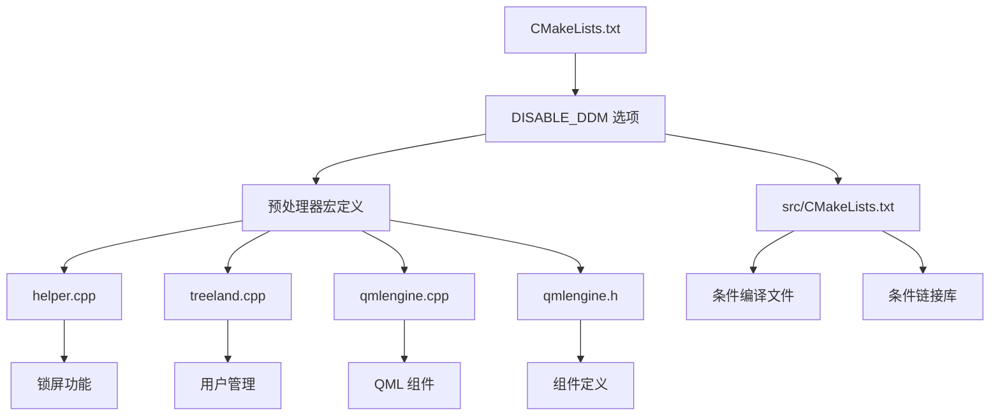

# DISABLE_DDM 功能依赖分析报告

## 概述

本文档分析了 `compositor` 目录中所有依赖 `DISABLE_DDM` 功能的文件和代码块。`DISABLE_DDM` 是一个 CMake 选项，用于禁用 DDM（Display Display Manager）和问候功能。

## CMake 选项定义

### compositor/CMakeLists.txt (第43-47行)
```cmake
option(DISABLE_DDM "Disable DDM and greeter" OFF)

if(DISABLE_DDM)
    add_compile_definitions("DISABLE_DDM")
endif()
```

**说明**: 当 `DISABLE_DDM` 选项被启用时，会添加 `DISABLE_DDM` 预处理器宏定义。

## CMake 条件编译逻辑

### compositor/src/CMakeLists.txt

#### 第14行: 条件查找 DDM 包
```cmake
if (NOT DISABLE_DDM)
    find_package(Dtk6 REQUIRED COMPONENTS Core Declarative SystemSettings Tools)
    if (NOT DISABLE_DDM)
        find_package(DDM 0.2.0 REQUIRED COMPONENTS Auth Common)
    endif()
endif()
```

**说明**: 当 `DISABLE_DDM` 未启用时，查找并包含 DDM 相关的包依赖。

#### 第112-121行: 条件编译锁屏相关文件
```cmake
$<$<NOT:$<BOOL:${DISABLE_DDM}>>:core/lockscreen.h>
$<$<NOT:$<BOOL:${DISABLE_DDM}>>:core/lockscreen.cpp>
$<$<NOT:$<BOOL:${DISABLE_DDM}>>:greeter/greeterproxy.cpp>
$<$<NOT:$<BOOL:${DISABLE_DDM}>>:greeter/greeterproxy.h>
$<$<NOT:$<BOOL:${DISABLE_DDM}>>:greeter/sessionmodel.cpp>
$<$<NOT:$<BOOL:${DISABLE_DDM}>>:greeter/sessionmodel.h>
$<$<NOT:$<BOOL:${DISABLE_DDM}>>:greeter/user.cpp>
$<$<NOT:$<BOOL:${DISABLE_DDM}>>:greeter/user.h>
$<$<NOT:$<BOOL:${DISABLE_DDM}>>:greeter/usermodel.cpp>
$<$<NOT:$<BOOL:${DISABLE_DDM}>>:greeter/usermodel.h>
```

**说明**: 当 `DISABLE_DDM` 未启用时，编译锁屏和问候相关的源文件。

#### 第298-300行: 条件链接 DDM 库
```cmake
PkgConfig::XCB
$<$<NOT:$<BOOL:${DISABLE_DDM}>>:DDM::Auth>
$<$<NOT:$<BOOL:${DISABLE_DDM}>>:DDM::Common>
$<$<NOT:$<BOOL:${DISABLE_DDM}>>:PkgConfig::PAM>
```

**说明**: 当 `DISABLE_DDM` 未启用时，链接 DDM 认证和通用库以及 PAM 库。

## C++ 代码依赖

### 1. compositor/src/seat/helper.cpp

#### 第16行: 包含锁屏头文件
```cpp
#ifndef DISABLE_DDM
#  include "core/lockscreen.h"
#endif
```

**说明**: 当 `DISABLE_DDM` 未定义时，包含锁屏功能的头文件。

#### 第789行: 检查是否为层表面
```cpp
#ifndef DISABLE_DDM
    if (isLayer) {
        connect(this, &Helper::currentModeChanged, wrapper, [this, wrapper] {
            wrapper->setHideByLockScreen(m_currentMode == CurrentMode::LockScreen);
        });
        wrapper->setHideByLockScreen(m_currentMode == CurrentMode::LockScreen);
    }
#endif
```

**说明**: 当 `DISABLE_DDM` 未定义时，为层表面设置锁屏隐藏逻辑。

#### 第1318行: 处理锁屏快捷键
```cpp
#ifndef DISABLE_DDM
    } else if (m_lockScreen && kevent->key() == Qt::Key_L) {
        if (m_lockScreen->isLocked()) {
            return true;
        }

        showLockScreen();
        return true;
#endif
```

**说明**: 当 `DISABLE_DDM` 未定义时，处理锁屏快捷键 (Meta+L)。

#### 第1988行: 创建锁屏实例
```cpp
#ifndef DISABLE_DDM
    m_lockScreen = new LockScreen(impl, m_rootSurfaceContainer);
    m_lockScreen->setZ(RootSurfaceContainer::LockScreenZOrder);
    m_lockScreen->setVisible(false);

    for (auto *output : m_rootSurfaceContainer->outputs()) {
        m_lockScreen->addOutput(output);
    }

    if (auto primaryOutput = m_rootSurfaceContainer->primaryOutput()) {
        m_lockScreen->setPrimaryOutputName(primaryOutput->output()->name());
    }

    connect(m_lockScreen, &LockScreen::unlock, this, [this] {
        setCurrentMode(CurrentMode::Normal);
        setWorkspaceVisible(true);

        if (m_activatedSurface) {
            m_activatedSurface->setFocus(true, Qt::NoFocusReason);
        }
    });

    if (CmdLine::ref().useLockScreen()) {
        showLockScreen(false);
    }
#endif
```

**说明**: 当 `DISABLE_DDM` 未定义时，创建并初始化锁屏功能。

### 2. compositor/src/core/treeland.cpp

#### 第18-29行: 包含锁屏接口和相关头文件
```cpp
#ifndef DISABLE_DDM
#  include "interfaces/lockscreeninterface.h"

#  include <Constants.h>
#  include <Messages.h>
#  include <SignalHandler.h>
#  include <SocketWriter.h>
using namespace DDM;

#  include <DAccountsManager>
#  include <DAccountsUser>
#endif
```

**说明**: 当 `DISABLE_DDM` 未定义时，包含锁屏接口和 DDM 相关的头文件。

#### 第58行: 初始化本地套接字
```cpp
#ifndef DISABLE_DDM
    , socket(new QLocalSocket(this))
#endif
```

**说明**: 当 `DISABLE_DDM` 未定义时，初始化用于 DDM 通信的本地套接字。

#### 第77-87行: 获取用户模型
```cpp
#ifndef DISABLE_DDM
    auto userModel = qmlEngine->singletonInstance<UserModel *>("DeckShell.Compositor", "UserModel");

    auto updateUser = [this, userModel] {
        auto user = userModel->currentUser();
        onCurrentChanged(user ? user->UID() : getuid());
    };

    connect(userModel, &UserModel::currentUserNameChanged, this, updateUser);
    updateUser();
#endif
```

**说明**: 当 `DISABLE_DDM` 未定义时，获取用户模型并设置用户更改监听。

#### 第106-136行: 定义用户更改回调函数
```cpp
#ifndef DISABLE_DDM
void onCurrentChanged(uid_t uid)
{
    // 用户更改处理逻辑
}
#endif
```

**说明**: 当 `DISABLE_DDM` 未定义时，定义用户更改时的回调函数。

#### 第209-218行: 连接用户模型信号
```cpp
#ifndef DISABLE_DDM
    connect(helper->qmlEngine()->singletonInstance<UserModel *>("DeckShell.Compositor", "UserModel"),
            &UserModel::currentUserNameChanged,
            pluginInstance,
            [this, plugin, scope] {
                updatePluginTs(plugin, scope);
            });

    updatePluginTs(plugin, scope);
#endif
```

**说明**: 当 `DISABLE_DDM` 未定义时，连接用户模型的信号以更新插件翻译。

#### 第228-236行: 检查锁屏插件
```cpp
#ifndef DISABLE_DDM
    if (auto *lockscreen = qobject_cast<ILockScreen *>(pluginInstance)) {
        qCDebug(treelandPlugin) << "Get LockScreen Instance.";
        connect(pluginInstance, &QObject::destroyed, this, [this] {
            helper->setLockScreenImpl(nullptr);
        });
        helper->setLockScreenImpl(lockscreen);
    }
#endif
```

**说明**: 当 `DISABLE_DDM` 未定义时，检查并设置锁屏插件实例。

#### 第242-244行: 定义账户管理器
```cpp
#ifndef DISABLE_DDM
    Dtk::Accounts::DAccountsManager manager;
#endif
```

**说明**: 当 `DISABLE_DDM` 未定义时，定义账户管理器用于用户管理。

### 3. compositor/src/core/qmlengine.cpp

#### 第33行: 定义锁屏组件
```cpp
#ifndef DISABLE_DDM
    , lockScreenComponent(this, "Treeland", "Greeter")
#endif
```

**说明**: 当 `DISABLE_DDM` 未定义时，定义锁屏 QML 组件。

#### 第196-204行: 创建锁屏组件
```cpp
QQuickItem *QmlEngine::createLockScreen(Output *output, QQuickItem *parent)
{
#ifndef DISABLE_DDM
    return createComponent(lockScreenComponent,
                           parent,
                           { { "output", QVariant::fromValue(output->output()) },
                             { "outputItem", QVariant::fromValue(output->outputItem()) } });
#else
    Q_UNREACHABLE_RETURN(nullptr);
#endif
}
```

**说明**: 当 `DISABLE_DDM` 未定义时，创建锁屏 QML 组件；否则返回空指针。

### 4. compositor/src/core/qmlengine.h

#### 第85-87行: 定义锁屏组件成员变量
```cpp
#ifndef DISABLE_DDM
    QQmlComponent lockScreenComponent;
#endif
```

**说明**: 当 `DISABLE_DDM` 未定义时，定义锁屏组件的成员变量。

## 依赖关系图



## 总结

在 `compositor` 目录中，`DISABLE_DDM` 功能被广泛使用，主要涉及以下方面：

1. **锁屏功能**: 当 `DISABLE_DDM` 未定义时，启用锁屏相关的所有功能
2. **用户管理**: 包括用户模型、账户管理和用户切换功能
3. **问候界面**: Greeter 相关的 QML 组件和逻辑
4. **DDM 集成**: 与 Display Display Manager 的集成

当 `DISABLE_DDM` 被启用时，所有这些功能将被禁用，编译时会排除相关的源文件和库依赖。

---
*分析时间: 2025-09-16*
*分析工具: Kilo Code Architect Mode*
*项目版本: waylib/examples/tinywl*
