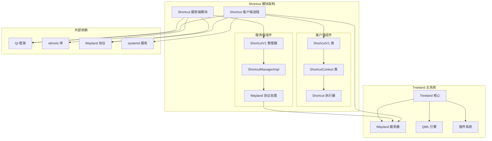

# Shortcut 模块依赖关系和调用关系分析报告

## 1. Shortcut 模块核心文件和依赖

### 1.1 核心文件结构

Shortcut 模块由两部分组成：

#### 1.1.1 服务端模块 (modules/shortcut/)
```
modules/shortcut/
├── shortcutmanager.h/cpp          # 主管理器类
├── impl/
│   ├── shortcut_manager_impl.h/cpp # Wayland 协议实现
└── CMakeLists.txt                 # 构建配置
```

#### 1.1.2 客户端进程 (treeland-shortcut/)
```
treeland-shortcut/
├── shortcut.h/cpp                 # 客户端主类
├── CMakeLists.txt                 # 构建配置
└── shortcuts/                     # 快捷键配置文件目录
```

### 1.2 外部依赖关系

#### 1.2.1 构建依赖
```cmake
# 服务端依赖
find_package(TreelandProtocols REQUIRED)
ws_generate_local(server ${TREELAND_PROTOCOLS_DATA_DIR}/treeland-shortcut-manager-v1.xml treeland-shortcut-manager-protocol)

# 链接库
target_link_libraries(module_shortcut
    PRIVATE
        PkgConfig::WLROOTS
        Waylib::WaylibServer
        Qt6::Core
        Qt6::Gui
        Qt6::Quick
)
```

#### 1.2.2 运行时依赖
- **Wayland 协议**: treeland-shortcut-manager-v1
- **Qt 框架**: Qt6 Core, Gui, Quick, DBus
- **wlroots**: Wayland 合成器库
- **systemd**: 服务管理

## 2. 与 Treeland 主控制器的交互

### 2.1 架构模式

Shortcut 模块采用**客户端-服务器架构**：

```
Treeland 主进程 (服务器)
    ↑↓ Wayland 协议
Shortcut 客户端进程
```

### 2.2 通信机制

#### 2.2.1 Wayland 协议通信
```cpp
// 服务端：ShortcutV1 类
class ShortcutV1 : public QObject, public WAYLIB_SERVER_NAMESPACE::WServerInterface {
public:
    void create(WServer *server) override {
        m_manager = treeland_shortcut_manager_v1::create(server->handle());
        connect(m_manager, &treeland_shortcut_manager_v1::newContext,
                this, &ShortcutV1::onNewContext);
    }
}
```

#### 2.2.2 协议接口
```cpp
// 协议定义 (treeland-shortcut-manager-v1.xml)
<interface name="treeland_shortcut_manager_v1" version="1">
    <request name="register_shortcut_context">
        <arg name="key" type="string"/>
    </request>
</interface>

<interface name="treeland_shortcut_context_v1" version="1">
    <event name="shortcut"/>
</interface>
```

### 2.3 启动依赖

#### 2.3.1 Systemd 服务依赖
```ini
# treeland-shortcut.service
[Unit]
Requires=treeland-sd.service
PartOf=treeland-sd.service
After=treeland-sd.service

[Service]
ExecCondition=/bin/sh -c 'test "$XDG_SESSION_DESKTOP" = "Treeland" || exit 2'
ExecStart=@CMAKE_INSTALL_FULL_LIBEXECDIR@/treeland-shortcut
```

## 3. 与 QML 引擎的交互

### 3.1 交互模式

**无直接交互** - Shortcut 模块作为独立进程运行：

```
Shortcut 进程 → Wayland 协议 → Treeland 服务器 → QML 引擎
```

### 3.2 间接影响

Shortcut 模块通过 Wayland 协议触发的事件可能影响 QML 界面：

```cpp
// 快捷键触发可能导致的 QML 响应
void ShortcutContext::treeland_shortcut_context_v1_shortcut() {
    Q_EMIT shortcutHappended();
    // 触发 QML 中的快捷键处理逻辑
}
```

## 4. 与插件系统的交互

### 4.1 交互模式

**无直接交互** - Shortcut 模块独立于插件系统：

- 插件系统在 Treeland 主进程中运行
- Shortcut 模块作为外部进程存在
- 通过 Wayland 协议进行松耦合通信

### 4.2 可能的扩展点

Shortcut 模块可以与插件系统通过以下方式交互：

```cpp
// 理论上的插件扩展接口
class ShortcutPluginInterface {
public:
    virtual void registerShortcut(const QString &key, std::function<void()> callback) = 0;
    virtual void unregisterShortcut(const QString &key) = 0;
};
```

## 5. 与其他模块的交互

### 5.1 模块间通信

Shortcut 模块与其他模块的交互主要通过 Treeland 主控制器：

```
Shortcut 模块 ← Wayland 协议 → Treeland 主控制器 → 其他模块
                                                    ↓
                                               [Capture, Personalization,
                                                Window Management, etc.]
```

### 5.2 具体交互场景

#### 5.2.1 与 Window Management 模块
```cpp
// 快捷键可能触发窗口管理操作
if (shortcut == "Super+D") {  // 显示桌面
    windowManagement->setDesktopState(DESKTOP_STATE_SHOW);
}
```

#### 5.2.2 与 MultitaskView 插件
```cpp
// 快捷键可能触发多任务视图
if (shortcut == "Super+Tab") {
    multitaskView->toggleMultitaskView(ActiveReason::ShortcutKey);
}
```

## 6. 从 main.cpp 的调用链

### 6.1 Treeland 主进程调用链

```
main.cpp (Treeland)
├── 创建 Treeland 实例
├── 初始化 QmlEngine
├── 加载插件系统
└── 启动事件循环
    └── Wayland 服务器运行
        └── 处理 Shortcut 客户端连接
```

### 6.2 Shortcut 客户端进程调用链

```
treeland-shortcut/main.cpp
├── 创建 QApplication
├── 创建 ShortcutV1 实例
├── 连接到 Wayland 显示
├── 加载快捷键配置
├── 注册快捷键上下文
└── 进入事件循环
    └── 监听快捷键事件
        └── 执行快捷键动作
```

### 6.3 完整的系统启动序列

```
1. systemd 启动 treeland-sd.service (socket 激活)
2. systemd 启动 treeland.service (主服务)
3. Treeland 主进程初始化 Wayland 服务器
4. systemd 启动 treeland-shortcut.service
5. Shortcut 客户端连接到 Wayland 服务器
6. 注册快捷键并开始监听
```

## 7. 依赖关系图



## 8. 在整体架构中的角色评估

### 8.1 架构定位

Shortcut 模块在 Treeland 架构中扮演**外围服务**角色：

```
┌─────────────────────────────────────┐
│          用户界面层                  │
│   [QML 界面, 插件界面]               │
├─────────────────────────────────────┤
│          业务逻辑层                  │
│   [Treeland 核心, 各功能模块]         │
├─────────────────────────────────────┤
│          外围服务层                  │
│   [Shortcut 模块, 其他独立服务]       │ ← 当前位置
├─────────────────────────────────────┤
│          系统服务层                  │
│   [Wayland, DBus, systemd]          │
└─────────────────────────────────────┘
```

### 8.2 设计优势

#### 8.2.1 解耦合设计
- **进程隔离**: 避免主进程崩溃影响快捷键功能
- **独立部署**: 可以独立更新和重启
- **资源隔离**: 快捷键处理不影响主进程性能

#### 8.2.2 可扩展性
- **协议驱动**: 通过 Wayland 协议实现松耦合
- **配置化**: 快捷键配置外部化
- **多类型支持**: 支持多种快捷键执行类型

### 8.3 潜在优化点

#### 8.3.1 性能优化
```cpp
// 当前实现的问题
void ShortcutV1::onNewContext(uid_t uid, treeland_shortcut_context_v1 *context) {
    QAction *action = new QAction(context);  // 每次都创建新对象
    // 建议：对象池复用
}
```

#### 8.3.2 架构优化
```cpp
// 可能的改进：集成到主进程
class IntegratedShortcutManager : public QObject {
    // 将快捷键处理集成到 Treeland 主进程
    // 减少进程间通信开销
};
```

#### 8.3.3 功能增强
- **快捷键冲突检测**: 检测和解决快捷键冲突
- **运行时配置**: 支持运行时修改快捷键配置
- **多用户支持**: 更好的多用户快捷键隔离

## 9. 关键代码片段

### 9.1 快捷键注册流程

```cpp
// 客户端：注册快捷键
ShortcutV1::ShortcutV1() {
    connect(this, &ShortcutV1::activeChanged, this, [this] {
        if (isActive()) {
            // 注册自定义快捷键
            for (auto &context : m_customShortcuts) {
                register_shortcut_context(context->shortcut());
            }

            // 注册系统快捷键
            for (auto &shortcut : m_treelandShortcuts) {
                register_shortcut_context(shortcut->shortcut());
            }
        }
    });
}
```

### 9.2 快捷键执行逻辑

```cpp
// 客户端：执行快捷键动作
void Shortcut::exec() {
    const QString &type = m_settings.value("Shortcut/Type").toString();

    if (type == "Exec") {
        QProcess::startDetached(m_settings.value("Type.Exec/Exec").toString(),
                               m_settings.value("Type.Exec/Args").toString().split(" "));
    }
    else if (type == "DBus") {
        QDBusInterface dbus(m_settings.value("Type.DBus/Service").toString(),
                           m_settings.value("Type.DBus/Path").toString(),
                           m_settings.value("Type.DBus/Interface").toString());
        dbus.asyncCall(m_settings.value("Type.DBus/Method").toString());
    }
    else if (type == "Application") {
        // 启动应用程序逻辑
    }
}
```

### 9.3 服务端协议处理

```cpp
// 服务端：处理快捷键上下文创建
static void create_shortcut_context_listener(struct wl_client *client,
                                           struct wl_resource *manager_resource,
                                           const char *key,
                                           uint32_t id) {
    auto *manager = shortcut_manager_from_resource(manager_resource);

    // 创建上下文资源
    auto *context = new treeland_shortcut_context_v1;
    // 设置协议实现
    wl_resource_set_implementation(resource, &shortcut_context_impl, context, nullptr);

    // 获取用户 ID 并通知管理器
    uid_t uid;
    wl_client_get_credentials(client, nullptr, &uid, nullptr);
    Q_EMIT manager->newContext(uid, context);
}
```

## 10. 总结

Shortcut 模块作为 Treeland 系统的独立外围服务，成功实现了快捷键功能的解耦合设计：

### 10.1 核心优势
1. **架构清晰**: 客户端-服务器分离，职责明确
2. **稳定性强**: 独立进程避免主进程影响
3. **扩展性好**: 支持多种快捷键执行类型
4. **配置灵活**: 外部配置文件驱动

### 10.2 技术亮点
1. **Wayland 协议**: 使用自定义协议实现通信
2. **Qt 集成**: 充分利用 Qt 的信号槽机制
3. **systemd 集成**: 完整的服务生命周期管理
4. **多用户支持**: 基于用户 ID 的快捷键隔离

### 10.3 改进建议
1. **性能优化**: 引入对象池减少内存分配
2. **功能增强**: 添加快捷键冲突检测
3. **监控完善**: 增加快捷键使用统计

---

*分析基于代码静态分析，实际运行时行为可能因配置和环境而异。*