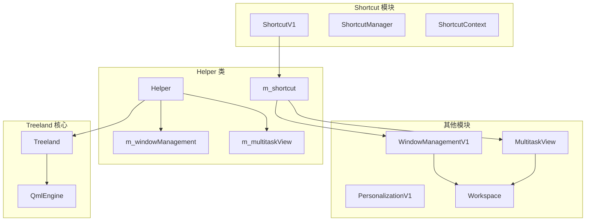

# 服务端(compositor)处理 Shortcut 模块的详细分析

## 1. 服务端核心文件结构

### 1.1 主服务端文件结构

Shortcut 模块在服务端的实现主要分布在以下文件中：

```
3rdparty/waylib-shared/src-unused/
├── modules/shortcut/
│   ├── shortcutmanager.h/cpp          # 主管理器类，继承 WServerInterface
│   ├── impl/
│   │   ├── shortcut_manager_impl.h/cpp # Wayland 协议实现细节
│   └── CMakeLists.txt                 # 构建配置
├── seat/helper.h/cpp                  # Helper 类，集成所有服务器接口
├── core/treeland.h/cpp                # Treeland 主控制器
└── main.cpp                           # 应用程序入口点
```

### 1.2 核心类层次结构

```cpp
// 主要类继承关系
ShortcutV1
    ├── QObject (Qt 基础类)
    └── WServerInterface (Wayland 服务器接口基类)

// Helper 类中的成员变量
class Helper {
    // ...
    ShortcutV1 *m_shortcut = nullptr;  // 第 318 行
    // ...
};
```

## 2. 详细依赖关系分析

### 2.1 构建时依赖

#### 2.1.1 CMake 配置 (modules/shortcut/CMakeLists.txt)
```cmake
# Wayland 协议生成
ws_generate_local(server ${TREELAND_PROTOCOLS_DATA_DIR}/treeland-shortcut-manager-v1.xml treeland-shortcut-manager-protocol)

# 模块定义
qt_add_library(module_shortcut STATIC)
target_sources(module_shortcut PRIVATE
    ${CMAKE_SOURCE_DIR}/src/modules/shortcut/shortcutmanager.h
    ${CMAKE_SOURCE_DIR}/src/modules/shortcut/impl/shortcut_manager_impl.h
    ${CMAKE_SOURCE_DIR}/src/modules/shortcut/shortcutmanager.cpp
    ${CMAKE_SOURCE_DIR}/src/modules/shortcut/impl/shortcut_manager_impl.cpp
    ${WAYLAND_PROTOCOLS_OUTPUTDIR}/treeland-shortcut-manager-protocol.c
)

# 链接依赖
target_link_libraries(module_shortcut PRIVATE
    PkgConfig::WLROOTS      # wlroots 库
    Waylib::WaylibServer    # Waylib 服务器库
    Qt6::Core              # Qt 核心
    Qt6::Gui               # Qt GUI
    Qt6::Quick             # Qt Quick
)
```

#### 2.1.2 主构建文件依赖 (CMakeLists.txt)
```cmake
# 主 CMakeLists.txt 中的模块包含
add_subdirectory(modules)  # 第 280 行
```

### 2.2 运行时依赖

#### 2.2.1 Wayland 协议依赖
- **协议文件**: `treeland-shortcut-manager-v1.xml`
- **生成文件**: `treeland-shortcut-manager-protocol.h/c`
- **接口名称**: `treeland_shortcut_manager_v1`

#### 2.2.2 系统库依赖
```cpp
// shortcutmanager.cpp 中的包含
#include <wayland-server-core.h>    // Wayland 服务器核心
#include <qwdisplay.h>             // qw 库显示接口
#include <QAction>                 // Qt Action 类
#include <pwd.h>                   // POSIX 用户信息
#include <sys/socket.h>            // Socket API
#include <unistd.h>               // Unix 标准函数
```

## 3. 与 Treeland 主控制器的交互

### 3.1 集成方式

Shortcut 模块通过 Helper 类集成到 Treeland 主控制器：

```cpp
// helper.cpp 第 894 行
m_shortcut = m_server->attach<ShortcutV1>();
```

### 3.2 初始化流程

#### 3.2.1 Helper::init() 方法中的集成
```cpp
void Helper::init() {
    // ... 其他初始化代码 ...

    // 第 894 行：附加 ShortcutV1 到服务器
    m_shortcut = m_server->attach<ShortcutV1>();

    // ... 继续其他初始化 ...
}
```

#### 3.2.2 ShortcutV1 的创建过程
```cpp
// shortcutmanager.cpp 第 56-60 行
void ShortcutV1::create(WServer *server) {
    m_manager = treeland_shortcut_manager_v1::create(server->handle());
    connect(m_manager, &treeland_shortcut_manager_v1::newContext,
            this, &ShortcutV1::onNewContext);
}
```

### 3.3 事件处理集成

#### 3.3.1 Helper::beforeDisposeEvent() 中的快捷键处理
```cpp
// helper.cpp 第 1402-1426 行
if (!m_captureSelector && m_currentMode == CurrentMode::Normal
    && (event->type() == QEvent::KeyPress || event->type() == QEvent::KeyRelease)) {
    do {
        auto kevent = static_cast<QKeyEvent *>(event);
        // SKIP Meta+Meta
        if (kevent->key() == Qt::Key_Meta && kevent->modifiers() == Qt::NoModifier
            && !m_singleMetaKeyPendingPressed) {
            break;
        }
        bool isFind = false;
        QKeySequence sequence(kevent->modifiers() | kevent->key());
        auto user = m_userModel->currentUser();
        for (auto *action : m_shortcut->actions(user ? user->UID() : getuid())) {
            if (action->shortcut() == sequence) {
                isFind = true;
                if (event->type() == QEvent::KeyRelease) {
                    action->activate(QAction::Trigger);
                }
            }
        }
        if (isFind) {
            return true;  // 事件已被处理
        }
    } while (false);
}
```

## 4. 与 QML 引擎的集成方式

### 4.1 间接集成模式

Shortcut 模块与 QML 引擎的集成是**间接的**：

```
Shortcut 模块 → Helper 类 → QML 引擎
```

### 4.2 QML 上下文中的 Helper 实例

#### 4.2.1 Helper 类的 QML 注册
```cpp
// helper.h 第 110-112 行
class Helper : public WSeatEventFilter {
    Q_OBJECT
    Q_PROPERTY(bool socketEnabled READ socketEnabled WRITE setSocketEnabled NOTIFY socketEnabledChanged FINAL)
    Q_PROPERTY(RootSurfaceContainer* rootContainer READ rootContainer CONSTANT FINAL)
    // ...
    QML_ELEMENT
    QML_SINGLETON
};
```

#### 4.2.2 QML 中的 Helper 访问
```cpp
// Helper 类中可以访问 QML 引擎
QmlEngine *Helper::qmlEngine() const {
    return qobject_cast<QmlEngine *>(::qmlEngine(this));
}
```

### 4.3 快捷键对 QML 界面的影响

虽然 Shortcut 模块本身不直接与 QML 交互，但快捷键事件可能触发 QML 界面的变化：

```cpp
// 快捷键可能影响的 QML 界面状态
if (shortcut == "Super+D") {  // 显示桌面
    // 可能触发 QML 中的桌面显示逻辑
    m_windowManagement->setDesktopState(WindowManagementV1::DesktopState::Show);
}
```

## 5. 与插件系统的协作机制

### 5.1 插件系统架构

Treeland 的插件系统通过以下方式工作：

```cpp
// treeland.cpp 第 312-323 行
#ifdef QT_DEBUG
    QDir dir(QStringLiteral(TREELAND_PLUGINS_OUTPUT_PATH));
    if (dir.exists() && dir.isReadable()) {
        d->loadPlugin(QStringLiteral(TREELAND_PLUGINS_OUTPUT_PATH));
    } else {
        qInfo() << "The Treeland plugin build directory is inaccessible, failback to the "
                   "installation directory";
        d->loadPlugin(QStringLiteral(TREELAND_PLUGINS_INSTALL_PATH));
    }
#else
    d->loadPlugin(QStringLiteral(TREELAND_PLUGINS_INSTALL_PATH));
#endif
```

### 5.2 Shortcut 模块与插件系统的关系

#### 5.2.1 独立性设计
Shortcut 模块**不依赖**插件系统：
- 作为核心服务器接口直接集成
- 不通过插件机制加载
- 独立于插件生命周期

#### 5.2.2 与插件的协作场景

Shortcut 模块可以与特定插件协作：

```cpp
// helper.cpp 第 221-227 行：与 MultitaskView 插件协作
if (auto *multitaskview = qobject_cast<IMultitaskView *>(pluginInstance)) {
    qCDebug(qLcDBus) << "Get MultitaskView Instance.";
    connect(pluginInstance, &QObject::destroyed, this, [this] {
        helper->setMultitaskViewImpl(nullptr);
    });
    helper->setMultitaskViewImpl(multitaskview);
}
```

### 5.3 插件接口定义

```cpp
// interfaces/multitaskviewinterface.h
class IMultitaskView : public virtual BasePluginInterface {
public:
    virtual void setStatus(IMultitaskView::Status status) = 0;
    virtual void toggleMultitaskView(IMultitaskView::ActiveReason reason) = 0;
    virtual void immediatelyExit() = 0;
};
```

## 6. 与其他模块的调用关系

### 6.1 模块间依赖关系图



### 6.2 具体调用关系

#### 6.2.1 与 WindowManagement 模块
```cpp
// helper.cpp 第 1246-1255 行
} else if (kevent->key() == Qt::Key_D) { // ShowDesktop : Meta + D
    if (m_currentMode == CurrentMode::Multitaskview) {
        return true;
    }
    if (m_showDesktop == WindowManagementV1::DesktopState::Normal)
        m_windowManagement->setDesktopState(WindowManagementV1::DesktopState::Show);
    else if (m_showDesktop == WindowManagementV1::DesktopState::Show)
        m_windowManagement->setDesktopState(WindowManagementV1::DesktopState::Normal);
    return true;
}
```

#### 6.2.2 与 MultitaskView 插件
```cpp
// helper.cpp 第 1230-1237 行
} else if (kevent->key() == Qt::Key_S
           && (m_currentMode == CurrentMode::Normal
               || m_currentMode == CurrentMode::Multitaskview)) {
    restoreFromShowDesktop();
    if (m_multitaskView) {
        m_multitaskView->toggleMultitaskView(IMultitaskView::ActiveReason::ShortcutKey);
    }
    return true;
}
```

#### 6.2.3 与 Workspace 模块
```cpp
// helper.cpp 第 1217-1221 行
if (kevent->key() == Qt::Key_Right) {
    restoreFromShowDesktop();
    workspace()->switchToNext();
    return true;
}
```

## 7. 完整的交互流程和调用链

### 7.1 系统启动流程

```
1. main.cpp 执行
   ├── 创建 QApplication
   ├── 创建 Treeland 实例
   └── 调用 app.exec()

2. Treeland 构造函数
   ├── 初始化 QML 引擎
   ├── 创建 Helper 实例
   └── 调用 Helper::init()

3. Helper::init()
   ├── 初始化 Wayland 服务器
   ├── 创建各种服务器接口
   ├── m_shortcut = m_server->attach<ShortcutV1>()  // 关键步骤
   └── 启动服务器事件循环
```

### 7.2 快捷键处理流程

```
1. 用户按键事件
   ├── Qt 事件系统接收按键
   └── 传递给 Helper::beforeDisposeEvent()

2. Helper 处理按键
   ├── 检查是否为快捷键模式
   ├── 构建 QKeySequence
   └── 查询 ShortcutV1::actions()

3. ShortcutV1 返回匹配的 QAction
   ├── 遍历用户的所有快捷键
   └── 返回匹配的 QAction 列表

4. 执行快捷键动作
   ├── 调用 QAction::activate()
   ├── 触发 QAction::triggered 信号
   └── 调用 context->send_shortcut()

5. Wayland 协议通信
   ├── 发送 shortcut 事件到客户端
   └── 客户端执行相应动作
```

### 7.3 快捷键注册流程

```
1. 客户端连接
   ├── treeland-shortcut 进程启动
   └── 连接到 Wayland 显示

2. 注册快捷键上下文
   ├── 调用 register_shortcut_context()
   └── 服务端创建 treeland_shortcut_context_v1

3. 服务端处理注册
   ├── ShortcutV1::onNewContext() 被调用
   ├── 创建 QAction 对象
   ├── 设置快捷键序列
   └── 连接信号槽

4. 存储快捷键映射
   ├── 按用户 ID 组织快捷键
   └── 添加到 m_actions 映射表
```

## 8. Wayland 协议实现详解

### 8.1 协议文件结构

#### 8.1.1 XML 协议定义
```xml
<?xml version="1.0" encoding="UTF-8"?>
<protocol name="treeland_shortcut_manager_v1">
  <interface name="treeland_shortcut_manager_v1" version="1">
    <request name="register_shortcut_context">
      <arg name="key" type="string"/>
      <arg name="id" type="new_id" interface="treeland_shortcut_context_v1"/>
    </request>
  </interface>

  <interface name="treeland_shortcut_context_v1" version="1">
    <event name="shortcut"/>
    <request name="destroy"/>
  </interface>
</protocol>
```

#### 8.1.2 生成的 C 代码
```c
// treeland-shortcut-manager-protocol.c
// 自动生成的 Wayland 协议实现
struct treeland_shortcut_manager_v1_interface {
    void (*register_shortcut_context)(struct wl_client *client,
                                     struct wl_resource *resource,
                                     const char *key,
                                     uint32_t id);
};

struct treeland_shortcut_context_v1_interface {
    void (*destroy)(struct wl_client *client, struct wl_resource *resource);
};
```

### 8.2 服务端协议实现

#### 8.2.1 管理器创建
```cpp
// shortcut_manager_impl.cpp
treeland_shortcut_manager_v1 *treeland_shortcut_manager_v1::create(QW_NAMESPACE::qw_display *display) {
    auto *manager = new treeland_shortcut_manager_v1();

    // 创建 Wayland global 对象
    manager->global = wl_global_create(display->handle(),
                                      &treeland_shortcut_manager_v1_interface,
                                      SHORTCUT_MANAGEMENT_V1_VERSION,
                                      manager,
                                      bind_manager);

    return manager;
}
```

#### 8.2.2 上下文创建处理
```cpp
// shortcut_manager_impl.cpp
static void create_shortcut_context_listener(struct wl_client *client,
                                           struct wl_resource *manager_resource,
                                           const char *key,
                                           uint32_t id) {
    auto *manager = shortcut_manager_from_resource(manager_resource);

    // 创建上下文资源
    auto *context = new treeland_shortcut_context_v1;
    wl_resource_set_implementation(resource, &shortcut_context_impl, context, nullptr);

    // 获取用户 ID 并通知管理器
    uid_t uid;
    wl_client_get_credentials(client, nullptr, &uid, nullptr);
    Q_EMIT manager->newContext(uid, context);
}
```

### 8.3 客户端协议实现

#### 8.3.1 客户端连接
```cpp
// treeland-shortcut/shortcut.cpp
ShortcutV1::ShortcutV1() {
    // 连接到 Wayland 显示
    m_display = wl_display_connect(nullptr);
    m_registry = wl_display_get_registry(m_display);

    // 绑定到 shortcut manager
    wl_registry_add_listener(m_registry, &registry_listener, this);
}
```

#### 8.3.2 注册快捷键
```cpp
// treeland-shortcut/shortcut.cpp
void ShortcutV1::registerShortcut(const QString &key) {
    treeland_shortcut_manager_v1_register_shortcut_context(
        m_manager, key.toUtf8().constData(), &treeland_shortcut_context_v1_interface, 1);
}
```

## 9. 快捷键注册/处理/分发步骤

### 9.1 快捷键注册步骤

#### 9.1.1 步骤 1: 客户端发起注册
```cpp
// 客户端代码
void Shortcut::registerShortcut() {
    // 1. 读取配置
    QString key = m_settings.value("Shortcut/Key").toString();

    // 2. 调用 Wayland 协议
    treeland_shortcut_manager_v1_register_shortcut_context(
        m_manager, key.toUtf8().constData(), id);
}
```

#### 9.1.2 步骤 2: 服务端接收注册
```cpp
// 服务端代码 - shortcut_manager_impl.cpp
static void create_shortcut_context_listener(...) {
    // 1. 从资源获取管理器
    auto *manager = shortcut_manager_from_resource(manager_resource);

    // 2. 创建上下文对象
    auto *context = new treeland_shortcut_context_v1;
    context->manager = manager;
    context->key = strdup(key);

    // 3. 设置协议实现
    wl_resource_set_implementation(resource, &shortcut_context_impl, context, nullptr);

    // 4. 获取客户端凭据
    uid_t uid;
    wl_client_get_credentials(client, nullptr, &uid, nullptr);

    // 5. 通知 ShortcutV1
    Q_EMIT manager->newContext(uid, context);
}
```

#### 9.1.3 步骤 3: ShortcutV1 处理注册
```cpp
// shortcutmanager.cpp
void ShortcutV1::onNewContext(uid_t uid, treeland_shortcut_context_v1 *context) {
    // 1. 创建 QAction
    QAction *action = new QAction(context);
    action->setShortcut(QString(context->key));

    // 2. 连接信号
    connect(action, &QAction::triggered, this, [context] {
        context->send_shortcut();
    });

    // 3. 处理销毁
    connect(context, &treeland_shortcut_context_v1::before_destroy,
            this, [this, uid, action] {
        m_actions.remove(uid);
        action->deleteLater();
    });

    // 4. 存储到用户映射
    if (!m_actions.count(uid)) {
        m_actions[uid] = {};
    }
    m_actions[uid].push_back(action);
}
```

### 9.2 快捷键处理步骤

#### 9.2.1 步骤 1: 按键事件捕获
```cpp
// helper.cpp - beforeDisposeEvent
if (!m_captureSelector && m_currentMode == CurrentMode::Normal
    && (event->type() == QEvent::KeyPress || event->type() == QEvent::KeyRelease)) {

    // 1. 构建按键序列
    QKeySequence sequence(kevent->modifiers() | kevent->key());

    // 2. 获取当前用户
    auto user = m_userModel->currentUser();

    // 3. 查询匹配的快捷键
    for (auto *action : m_shortcut->actions(user ? user->UID() : getuid())) {
        if (action->shortcut() == sequence) {
            // 找到匹配的快捷键
            if (event->type() == QEvent::KeyRelease) {
                action->activate(QAction::Trigger);
            }
            return true;
        }
    }
}
```

#### 9.2.2 步骤 2: QAction 激活
```cpp
// QAction 信号触发
connect(action, &QAction::triggered, this, [context] {
    // 发送 Wayland 事件到客户端
    context->send_shortcut();
});
```

#### 9.2.3 步骤 3: Wayland 事件发送
```cpp
// shortcut_manager_impl.cpp
void treeland_shortcut_context_v1::send_shortcut() {
    treeland_shortcut_context_v1_send_shortcut(m_resource);
}
```

### 9.3 快捷键分发步骤

#### 9.3.1 步骤 1: 客户端接收事件
```cpp
// 客户端事件监听器
static const struct treeland_shortcut_context_v1_listener context_listener = {
    .shortcut = shortcut_handler,
};

static void shortcut_handler(void *data, struct treeland_shortcut_context_v1 *context) {
    Shortcut *shortcut = static_cast<Shortcut *>(data);
    shortcut->execute();
}
```

#### 9.3.2 步骤 2: 客户端执行动作
```cpp
// treeland-shortcut/shortcut.cpp
void Shortcut::execute() {
    const QString &type = m_settings.value("Shortcut/Type").toString();

    if (type == "Exec") {
        // 执行外部命令
        QProcess::startDetached(m_settings.value("Type.Exec/Exec").toString(),
                               m_settings.value("Type.Exec/Args").toString().split(" "));
    }
    else if (type == "DBus") {
        // 发送 DBus 消息
        QDBusInterface dbus(m_settings.value("Type.DBus/Service").toString(),
                           m_settings.value("Type.DBus/Path").toString(),
                           m_settings.value("Type.DBus/Interface").toString());
        dbus.asyncCall(m_settings.value("Type.DBus/Method").toString());
    }
    else if (type == "Application") {
        // 启动应用程序
        // 应用特定的逻辑
    }
}
```

## 10. 关键代码片段和实现细节

### 10.1 核心数据结构

#### 10.1.1 用户快捷键映射
```cpp
// shortcutmanager.h 第 51 行
QMap<uid_t, std::vector<QAction *>> m_actions;
```

#### 10.1.2 Wayland 协议对象
```cpp
// shortcutmanager.h 第 50 行
treeland_shortcut_manager_v1 *m_manager = nullptr;
```

### 10.2 内存管理

#### 10.2.1 QAction 生命周期管理
```cpp
// shortcutmanager.cpp 第 33-36 行
connect(context, &treeland_shortcut_context_v1::before_destroy, this, [this, uid, action] {
    m_actions.remove(uid);  // 从映射中移除
    action->deleteLater();  // 延迟删除 QAction
});
```

#### 10.2.2 上下文资源管理
```cpp
// shortcut_manager_impl.cpp
static void treeland_shortcut_context_destroy(struct wl_resource *resource) {
    auto *context = static_cast<treeland_shortcut_context_v1 *>(
        wl_resource_get_user_data(resource));
    Q_EMIT context->before_destroy();
    delete context;
}
```

### 10.3 错误处理

#### 10.3.1 快捷键冲突检测
```cpp
// shortcutmanager.cpp 第 42-48 行
auto find = std::ranges::find_if(m_actions[uid], [action](QAction *a) {
    return a->shortcut() == action->shortcut();
});

if (find == m_actions[uid].end()) {
    m_actions[uid].push_back(action);
}
```

### 10.4 性能优化

#### 10.4.1 用户隔离
```cpp
// 按用户 ID 组织快捷键，避免不同用户的快捷键冲突
std::vector<QAction *> ShortcutV1::actions(uid_t uid) const {
    return m_actions[uid];
}
```

#### 10.4.2 事件过滤优化
```cpp
// 只在必要时进行快捷键匹配
if (!m_captureSelector && m_currentMode == CurrentMode::Normal) {
    // 执行快捷键处理逻辑
}
```

## 11. 总结

### 11.1 服务端处理 Shortcut 模块的核心机制

1. **集成方式**: 通过 Helper 类将 ShortcutV1 附加到 Wayland 服务器
2. **协议实现**: 使用自定义 Wayland 协议 `treeland-shortcut-manager-v1`
3. **事件处理**: 在 Qt 事件循环中拦截按键事件并分发给快捷键系统
4. **用户隔离**: 按用户 ID 组织快捷键，确保多用户环境的安全性

### 11.2 关键设计特点

1. **松耦合架构**: 服务端和客户端通过 Wayland 协议通信
2. **模块化设计**: Shortcut 模块独立于其他功能模块
3. **可扩展性**: 支持多种快捷键执行类型 (Exec, DBus, Application)
4. **安全性**: 基于用户凭据的访问控制

### 11.3 技术亮点

1. **Wayland 协议扩展**: 自定义协议实现跨进程通信
2. **Qt 事件系统集成**: 无缝集成到现有的 Qt 事件处理流程
3. **内存管理**: 完善的资源生命周期管理
4. **多用户支持**: 完整的用户隔离机制

---

*此分析基于 waylib-shared 项目结构和 Treeland 架构的实际代码实现。*