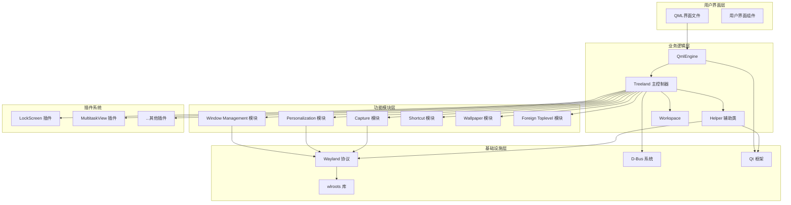
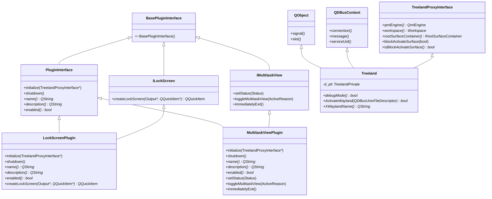
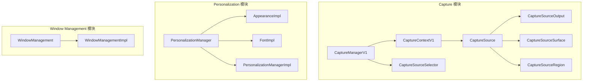
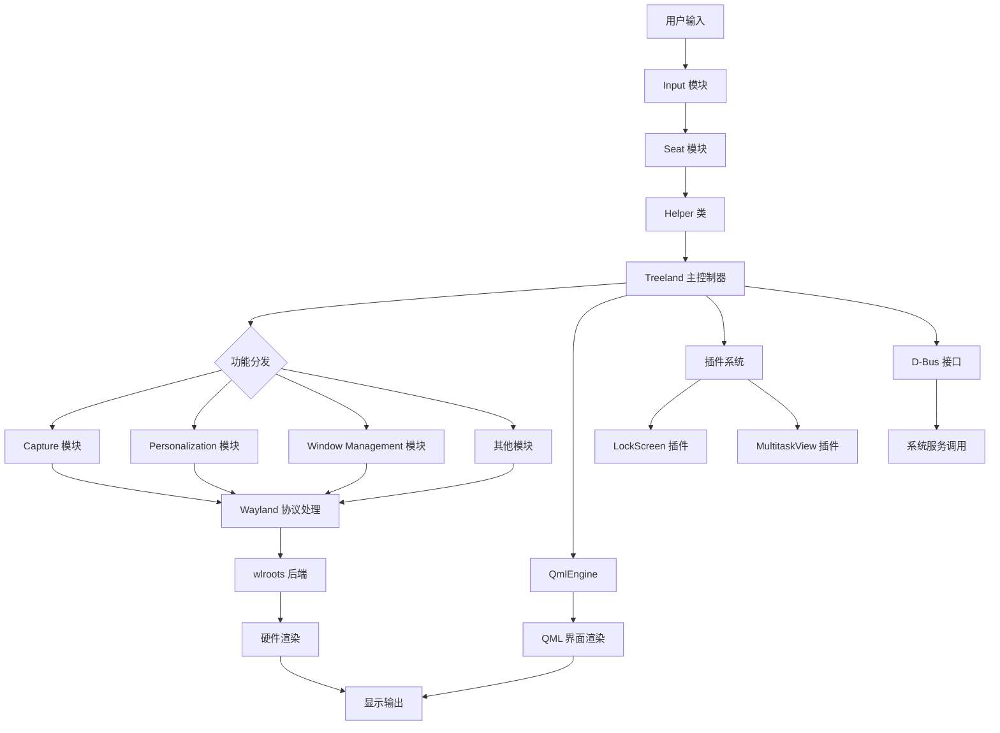
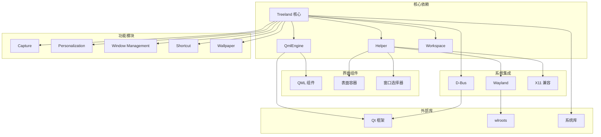
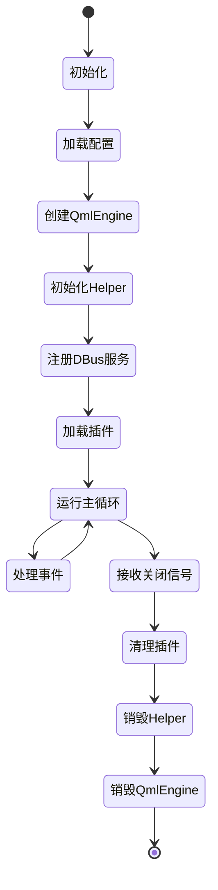
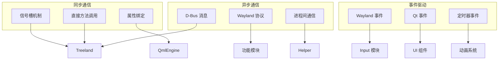

# Treeland 架构图表

## 1. 整体架构图



## 2. 类继承关系图



## 3. 模块架构图



## 4. 数据流图



## 5. 插件加载流程图

```mermaid
flowchart TD
    A[启动 Treeland] --> B[扫描插件目录]
    B --> C{找到插件文件?}

    C -->|是| D[创建 QPluginLoader]
    C -->|否| F[完成加载]

    D --> E{加载成功?}
    E -->|是| G[创建插件实例]
    E -->|否| H[记录错误]

    G --> I{实现 PluginInterface?}
    I -->|是| J[调用 initialize()]
    I -->|否| K[记录错误]

    J --> L{是 LockScreen 插件?}
    L -->|是| M[注册 ILockScreen]
    L -->|否| N{是 MultitaskView 插件?}

    N -->|是| O[注册 IMultitaskView]
    N -->|否| P[注册为通用插件]

    M --> Q[连接插件信号]
    O --> Q
    P --> Q

    Q --> R[设置插件翻译]
    R --> S[添加到插件列表]
    S --> B

    H --> B
    K --> B
```

## 6. 组件依赖图



## 7. 生命周期图



## 8. 通信模式图



---

*图表说明：以上图表基于代码分析绘制，展示了Treeland项目的整体架构、类关系、数据流和通信模式。实际实现可能因运行时条件而有所不同。*