以下为 treeland-dde-shell-v1 协议的完整功能清单与用法说明，已结合协议 XML 与服务端实现源码进行逐项对应。每条目均包含用途、调用方式、参数/事件信息及关键实现位置的可点击引用。

一、协议管理器与入口
- 管理器接口: [treeland_dde_shell_manager_v1](protocols/compositor/xml/treeland-dde-shell-v1.xml:7)
  - 客户端通过 wl_registry 绑定后，使用以下请求创建子对象：
    - [get_window_overlap_checker](protocols/compositor/xml/treeland-dde-shell-v1.xml:16)
    - [get_shell_surface](protocols/compositor/xml/treeland-dde-shell-v1.xml:20)
    - [get_treeland_dde_active](protocols/compositor/xml/treeland-dde-shell-v1.xml:32)
    - [get_treeland_multitaskview](protocols/compositor/xml/treeland-dde-shell-v1.xml:40)
    - [get_treeland_window_picker](protocols/compositor/xml/treeland-dde-shell-v1.xml:47)
    - [get_treeland_lockscreen](protocols/compositor/xml/treeland-dde-shell-v1.xml:54)
  - 服务端对应创建逻辑：
    - 窗口重叠检测: [DDEShellManagerInterfaceV1Private::treeland_dde_shell_manager_v1_get_window_overlap_checker](compositor/src/modules/dde-shell/ddeshellmanagerinterfacev1.cpp:82)
    - ShellSurface 对象: [DDEShellManagerInterfaceV1Private::treeland_dde_shell_manager_v1_get_shell_surface](compositor/src/modules/dde-shell/ddeshellmanagerinterfacev1.cpp:105)
    - 活动监控: [DDEShellManagerInterfaceV1Private::treeland_dde_shell_manager_v1_get_treeland_dde_active](compositor/src/modules/dde-shell/ddeshellmanagerinterfacev1.cpp:138)
    - 多任务视图: [DDEShellManagerInterfaceV1Private::treeland_dde_shell_manager_v1_get_treeland_multitaskview](compositor/src/modules/dde-shell/ddeshellmanagerinterfacev1.cpp:170)
    - 窗口拾取器: [DDEShellManagerInterfaceV1Private::treeland_dde_shell_manager_v1_get_treeland_window_picker](compositor/src/modules/dde-shell/ddeshellmanagerinterfacev1.cpp:198)
    - 锁屏: [DDEShellManagerInterfaceV1Private::treeland_dde_shell_manager_v1_get_treeland_lockscreen](compositor/src/modules/dde-shell/ddeshellmanagerinterfacev1.cpp:50)

二、窗口重叠检测 treeland_window_overlap_checker
- 创建方式: [get_window_overlap_checker](protocols/compositor/xml/treeland-dde-shell-v1.xml:16)
- 用途: 在指定输出上注册一个检测区域，若工作区内 toplevel 与该区域发生重叠，服务端发送 enter/leave 事件，适用于面板/顶栏与窗口重叠状态联动。
- 客户端请求:
  - 更新检测区域: [treeland_window_overlap_checker.update](protocols/compositor/xml/treeland-dde-shell-v1.xml:98)
    - 参数:
      - width(int), height(int): 区域尺寸
      - anchor(uint): 边锚点枚举 [anchor.top/bottom/left/right](protocols/compositor/xml/treeland-dde-shell-v1.xml:88)
      - output(wl_output 非空)
    - 服务端处理与冲突表登记: [WindowOverlapCheckerInterfacePrivate::treeland_window_overlap_checker_update](compositor/src/modules/dde-shell/ddeshellmanagerinterfacev1.cpp:652)
  - 销毁: [treeland_window_overlap_checker.destroy](protocols/compositor/xml/treeland-dde-shell-v1.xml:112)；资源销毁流程: [treeland_window_overlap_checker_destroy](compositor/src/modules/dde-shell/ddeshellmanagerinterfacev1.cpp:691)
- 事件:
  - overlap 出现: [enter](protocols/compositor/xml/treeland-dde-shell-v1.xml:74)
  - overlap 消失: [leave](protocols/compositor/xml/treeland-dde-shell-v1.xml:81)
  - 发送逻辑（去抖处理）: [WindowOverlapCheckerInterface::sendOverlapped](compositor/src/modules/dde-shell/ddeshellmanagerinterfacev1.cpp:609)

三、Shell Surface 扩展 treeland_dde_shell_surface_v1
- 创建方式: [treeland_dde_shell_manager_v1.get_shell_surface](protocols/compositor/xml/treeland-dde-shell-v1.xml:20)
  - 参数: id(new_id), surface(wl_surface)
  - 约束: 一个 wl_surface 仅能关联一个 shell-surface（服务端唯一性检查）: [唯一性检查](compositor/src/modules/dde-shell/ddeshellmanagerinterfacev1.cpp:115)
- 用途: 为顶层窗口附加 UI 元数据与偏好（位置、角色、在各视图中的可见性、键盘焦点行为等）。
- 客户端请求与参数/效果:
  - 销毁对象: [treeland_dde_shell_surface_v1.destroy](protocols/compositor/xml/treeland-dde-shell-v1.xml:137)；服务端销毁: [treeland_dde_shell_surface_v1_destroy](compositor/src/modules/dde-shell/ddeshellmanagerinterfacev1.cpp:306)
  - 设置全局位置: [treeland_dde_shell_surface_v1.set_surface_position](protocols/compositor/xml/treeland-dde-shell-v1.xml:147)
    - 参数: x(int), y(int)（全局坐标，跨输出）
    - 信号: [DDEShellSurfaceInterface::positionChanged](compositor/src/modules/dde-shell/ddeshellmanagerinterfacev1.h:78)；赋值逻辑: [set_surface_position 实现](compositor/src/modules/dde-shell/ddeshellmanagerinterfacev1.cpp:311)
  - 设置角色: [treeland_dde_shell_surface_v1.set_role](protocols/compositor/xml/treeland-dde-shell-v1.xml:170)
    - 参数: role(uint)（当前定义 overlay=1）[role.enum](protocols/compositor/xml/treeland-dde-shell-v1.xml:158)
    - 信号: [roleChanged](compositor/src/modules/dde-shell/ddeshellmanagerinterfacev1.h:79)；映射校验: [set_role 实现](compositor/src/modules/dde-shell/ddeshellmanagerinterfacev1.cpp:325)
  - 自动布局: [treeland_dde_shell_surface_v1.set_auto_placement](protocols/compositor/xml/treeland-dde-shell-v1.xml:178)
    - 参数: y_offset(uint)；与 set_surface_position 互斥，交由合成器避免越界
    - 信号: [yOffsetChanged](compositor/src/modules/dde-shell/ddeshellmanagerinterfacev1.h:80)；实现: [set_auto_placement](compositor/src/modules/dde-shell/ddeshellmanagerinterfacev1.cpp:349)
  - 跳过任务切换器: [treeland_dde_shell_surface_v1.set_skip_switcher](protocols/compositor/xml/treeland-dde-shell-v1.xml:190)
    - 参数: skip(uint 0/1)
    - 信号: [skipSwitcherChanged](compositor/src/modules/dde-shell/ddeshellmanagerinterfacev1.h:81)；实现: [set_skip_switcher](compositor/src/modules/dde-shell/ddeshellmanagerinterfacev1.cpp:360)
  - 跳过 Dock 预览: [treeland_dde_shell_surface_v1.set_skip_dock_preview](protocols/compositor/xml/treeland-dde-shell-v1.xml:198)
    - 参数: skip(uint 0/1)
    - 信号/实现: [skipDockPreViewChanged](compositor/src/modules/dde-shell/ddeshellmanagerinterfacev1.h:82) / [set_skip_dock_preview](compositor/src/modules/dde-shell/ddeshellmanagerinterfacev1.cpp:371)
  - 跳过多任务视图: [treeland_dde_shell_surface_v1.set_skip_muti_task_view](protocols/compositor/xml/treeland-dde-shell-v1.xml:205)
    - 参数: skip(uint 0/1)
    - 信号/实现: [skipMutiTaskViewChanged](compositor/src/modules/dde-shell/ddeshellmanagerinterfacev1.h:83) / [set_skip_muti_task_view](compositor/src/modules/dde-shell/ddeshellmanagerinterfacev1.cpp:382)
  - 键盘焦点接受: [treeland_dde_shell_surface_v1.set_accept_keyboard_focus](protocols/compositor/xml/treeland-dde-shell-v1.xml:212)
    - 参数: accept(uint 0/1，默认1，可拒绝焦点)
    - 信号/实现: [acceptKeyboardFocusChanged](compositor/src/modules/dde-shell/ddeshellmanagerinterfacev1.h:84) / [set_accept_keyboard_focus](compositor/src/modules/dde-shell/ddeshellmanagerinterfacev1.cpp:392)
- 服务端对象辅助方法:
  - 由 wl_resource 查询: [DDEShellSurfaceInterface::get(wl_resource*)](compositor/src/modules/dde-shell/ddeshellmanagerinterfacev1.cpp:456)
  - 由 WSurface 查询: [DDEShellSurfaceInterface::get(WSurface*)](compositor/src/modules/dde-shell/ddeshellmanagerinterfacev1.cpp:466)
  - 获取关联 WSurface: [DDEShellSurfaceInterface::wSurface()](compositor/src/modules/dde-shell/ddeshellmanagerinterfacev1.cpp:411)

四、活动事件监控 treeland_dde_active_v1
- 创建方式: [get_treeland_dde_active](protocols/compositor/xml/treeland-dde-shell-v1.xml:32)
  - 参数: id(new_id), seat(wl_seat)
- 用途: 监听合成器侧用户活动与拖拽生命周期事件。
- 事件:
  - 活动进入/退出: [active_in](protocols/compositor/xml/treeland-dde-shell-v1.xml:239), [active_out](protocols/compositor/xml/treeland-dde-shell-v1.xml:243)
    - 参数: reason(uint) 枚举 [reason.mouse=0, reason.wheel=1](protocols/compositor/xml/treeland-dde-shell-v1.xml:232)
  - 拖拽: [start_drag](protocols/compositor/xml/treeland-dde-shell-v1.xml:248), [drop](protocols/compositor/xml/treeland-dde-shell-v1.xml:253)
- 服务端发送 API:
  - 单对象发送: [DDEActiveInterface::sendActiveIn/Out/StartDrag/Drop](compositor/src/modules/dde-shell/ddeshellmanagerinterfacev1.cpp:524)
  - 按 seat 广播: [DDEActiveInterface::sendActiveIn/Out/StartDrag/Drop 静态重载](compositor/src/modules/dde-shell/ddeshellmanagerinterfacev1.cpp:543)

五、多任务视图 treeland_multitaskview_v1
- 创建方式: [get_treeland_multitaskview](protocols/compositor/xml/treeland-dde-shell-v1.xml:40)
- 用途: 由客户端触发多任务视图显隐切换。
- 请求:
  - 切换: [treeland_multitaskview_v1.toggle](protocols/compositor/xml/treeland-dde-shell-v1.xml:267)
  - 服务端转发为管理器信号，供系统上层处理: [MultiTaskViewInterfacePrivate::treeland_multitaskview_v1_toggle](compositor/src/modules/dde-shell/ddeshellmanagerinterfacev1.cpp:727) → [DDEShellManagerInterfaceV1::toggleMultitaskview](compositor/src/modules/dde-shell/ddeshellmanagerinterfacev1.h:40)

六、窗口拾取器 treeland_window_picker_v1
- 创建方式: [get_treeland_window_picker](protocols/compositor/xml/treeland-dde-shell-v1.xml:47)
- 用途: 启动窗口选择，返回所选窗口的 PID，适合授权与定向操作。
- 请求与事件:
  - 发起拾取: [treeland_window_picker_v1.pick](protocols/compositor/xml/treeland-dde-shell-v1.xml:284) 参数 hint(string)
  - 服务端将请求转发到系统层处理: [WindowPickerInterfacePrivate::treeland_window_picker_v1_pick](compositor/src/modules/dde-shell/ddeshellmanagerinterfacev1.cpp:770)
  - 返回所选 pid: [treeland_window_picker_v1.window](protocols/compositor/xml/treeland-dde-shell-v1.xml:291)；发送函数: [WindowPickerInterface::sendWindowPid](compositor/src/modules/dde-shell/ddeshellmanagerinterfacev1.cpp:778)

七、锁屏 treeland_lockscreen_v1
- 创建方式: [get_treeland_lockscreen](protocols/compositor/xml/treeland-dde-shell-v1.xml:54)
- 用途: 控制锁屏、关机面板与切换用户。
- 请求:
  - 锁屏: [treeland_lockscreen_v1.lock](protocols/compositor/xml/treeland-dde-shell-v1.xml:309) → [treeland_lockscreen_v1_lock](compositor/src/modules/dde-shell/ddeshellmanagerinterfacev1.cpp:803)
  - 显示关机: [treeland_lockscreen_v1.shutdown](protocols/compositor/xml/treeland-dde-shell-v1.xml:315) → [treeland_lockscreen_v1_shutdown](compositor/src/modules/dde-shell/ddeshellmanagerinterfacev1.cpp:809)
  - 切换用户: [treeland_lockscreen_v1.switch_user](protocols/compositor/xml/treeland-dde-shell-v1.xml:321) → [treeland_lockscreen_v1_switch_user](compositor/src/modules/dde-shell/ddeshellmanagerinterfacev1.cpp:813)

八、生命周期与销毁
- 所有子对象提供 destroy 请求：
  - ShellSurface: [destroy](protocols/compositor/xml/treeland-dde-shell-v1.xml:137) → [treeland_dde_shell_surface_v1_destroy](compositor/src/modules/dde-shell/ddeshellmanagerinterfacev1.cpp:306)
  - OverlapChecker: [destroy](protocols/compositor/xml/treeland-dde-shell-v1.xml:112) → [treeland_window_overlap_checker_destroy](compositor/src/modules/dde-shell/ddeshellmanagerinterfacev1.cpp:691)
  - Multitaskview: [destroy](protocols/compositor/xml/treeland-dde-shell-v1.xml:263) → [treeland_multitaskview_v1_destroy](compositor/src/modules/dde-shell/ddeshellmanagerinterfacev1.cpp:722)
  - WindowPicker: [destroy](protocols/compositor/xml/treeland-dde-shell-v1.xml:279) → [treeland_window_picker_v1_destroy](compositor/src/modules/dde-shell/ddeshellmanagerinterfacev1.cpp:764)
  - Lockscreen: [destroy](protocols/compositor/xml/treeland-dde-shell-v1.xml:305) → [treeland_lockscreen_v1_destroy](compositor/src/modules/dde-shell/ddeshellmanagerinterfacev1.cpp:830)
  - Active: [destroy](protocols/compositor/xml/treeland-dde-shell-v1.xml:227) → [treeland_dde_active_v1_destroy](compositor/src/modules/dde-shell/ddeshellmanagerinterfacev1.cpp:504)
- 注意：ShellSurface 在 wl_surface 销毁时也会被服务端自动清理，客户端仍应在销毁 wl_surface 前先发 destroy 遵循协议。

九、典型客户端调用序列
- 新建窗口并设置偏好：
  - 绑定管理器 → [get_shell_surface](protocols/compositor/xml/treeland-dde-shell-v1.xml:20)
  - 设置跳过任务切换器 → [set_skip_switcher(skip=1)](protocols/compositor/xml/treeland-dde-shell-v1.xml:190)
  - 设定角色 overlay → [set_role(overlay)](protocols/compositor/xml/treeland-dde-shell-v1.xml:170)
  - 二选一的定位策略：自动布局 [set_auto_placement(y_offset)](protocols/compositor/xml/treeland-dde-shell-v1.xml:178) 或手动位置 [set_surface_position(x,y)](protocols/compositor/xml/treeland-dde-shell-v1.xml:147)
- 监听用户活动：
  - [get_treeland_dde_active(seat)](protocols/compositor/xml/treeland-dde-shell-v1.xml:32) 并处理 [active_in/out](protocols/compositor/xml/treeland-dde-shell-v1.xml:239)
- 触发多任务视图：
  - [get_treeland_multitaskview](protocols/compositor/xml/treeland-dde-shell-v1.xml:40) → [toggle](protocols/compositor/xml/treeland-dde-shell-v1.xml:267)
- 窗口拾取：
  - [get_treeland_window_picker](protocols/compositor/xml/treeland-dde-shell-v1.xml:47) → [pick(hint)](protocols/compositor/xml/treeland-dde-shell-v1.xml:284) → 等待 [window(pid)](protocols/compositor/xml/treeland-dde-shell-v1.xml:291)
- 控制锁屏：
  - [get_treeland_lockscreen](protocols/compositor/xml/treeland-dde-shell-v1.xml:54) → [lock/shutdown/switch_user](protocols/compositor/xml/treeland-dde-shell-v1.xml:309)

十、Mermaid 关系示意

```mermaid
flowchart TD
  A[treeland_dde_shell_manager_v1] --> B[get_window_overlap_checker]
  A --> C[get_shell_surface]
  A --> D[get_treeland_dde_active]
  A --> E[get_treeland_multitaskview]
  A --> F[get_treeland_window_picker]
  A --> G[get_treeland_lockscreen]

  C --> C1[set_surface_position]
  C --> C2[set_role overlay]
  C --> C3[set_auto_placement y_offset]
  C --> C4[set_skip_switcher]
  C --> C5[set_skip_dock_preview]
  C --> C6[set_skip_muti_task_view]
  C --> C7[set_accept_keyboard_focus]

  B --> B1[enter]
  B --> B2[leave]

  D --> D1[active_in mouse or wheel]
  D --> D2[active_out mouse or wheel]
  D --> D3[start_drag]
  D --> D4[drop]

  E --> E1[toggle]

  F --> F1[pick hint]
  F --> F2[window pid]

  G --> G1[lock]
  G --> G2[shutdown]
  G --> G3[switch_user]
```


十一、使用注意与约束
- ShellSurface 与 wl_surface 1:1 关联，重复创建会被服务端拒绝: [唯一性检查](compositor/src/modules/dde-shell/ddeshellmanagerinterfacev1.cpp:115)
- set_auto_placement 与 set_surface_position 不应混用；使用自动布局时位置由合成器控制并防越界
- overlap 检测 update 只记录当次窗口几何；窗口移动后需重新调用 update 刷新: [update 语义](protocols/compositor/xml/treeland-dde-shell-v1.xml:98)
- 事件均为异步通知；客户端需正确管理对象生命周期并在合适时机 destroy

---

## 协议功能清单（简化版）

以下为对协议文件 [treeland-dde-shell-v1.xml](protocols/compositor/xml/treeland-dde-shell-v1.xml) 的系统化分析。内容覆盖客户端可实现的功能、用途、调用方式，以及参数/事件（返回值）说明，并给出典型使用流程与注意事项。为便于核对，所有接口、请求、事件、枚举均以可点击的"语言构造"形式标注到具体行。

### 总体概览
- 协议命名空间：treeland_dde_shell_v1
- 管理器接口：treeland_dde_shell_manager_v1
- 子接口：
  - treeland_dde_shell_surface_v1（面向具体 wl_surface 的 DDE Shell 元数据接口）
  - treeland_window_overlap_checker（窗口重叠检测）
  - treeland_dde_active_v1（活跃与拖拽事件监控）
  - treeland_multitaskview_v1（多任务视图开关）
  - treeland_window_picker_v1（窗口拾取与凭据返回）
  - treeland_lockscreen_v1（锁屏相关操作）
- 版本与状态：均为 version="1"，协议处于测试阶段（文件头部说明）

### 1) 管理器接口：treeland_dde_shell_manager_v1
- 作用：提供各子接口对象的创建入口，客户端先绑定此全局后，再通过请求获取子接口。
- 请求与用途：
  - [treeland_dde_shell_manager_v1.get_window_overlap_checker()](protocols/compositor/xml/treeland-dde-shell-v1.xml:16)
    - 用途：创建窗口重叠检测器 treeland_window_overlap_checker。
    - 参数：id（new_id，返回该对象）
  - [treeland_dde_shell_manager_v1.get_shell_surface()](protocols/compositor/xml/treeland-dde-shell-v1.xml:20)
    - 用途：为已存在的 wl_surface 创建 DDE shell surface（绑定元数据与行为）。
    - 参数：id（new_id，返回 treeland_dde_shell_surface_v1）、surface（wl_surface）
    - 约束：同一 surface 仅允许创建一个 shell surface；推荐与 xdg_surface 搭配。
  - [treeland_dde_shell_manager_v1.get_treeland_dde_active()](protocols/compositor/xml/treeland-dde-shell-v1.xml:32)
    - 用途：创建活跃事件监控 treeland_dde_active_v1。
    - 参数：id（new_id）、seat（wl_seat）
  - [treeland_dde_shell_manager_v1.get_treeland_multitaskview()](protocols/compositor/xml/treeland-dde-shell-v1.xml:40)
    - 用途：创建多任务视图控制对象 treeland_multitaskview_v1。
    - 参数：id（new_id）
  - [treeland_dde_shell_manager_v1.get_treeland_window_picker()](protocols/compositor/xml/treeland-dde-shell-v1.xml:47)
    - 用途：创建窗口拾取对象 treeland_window_picker_v1。
    - 参数：id（new_id）
  - [treeland_dde_shell_manager_v1.get_treeland_lockscreen()](protocols/compositor/xml/treeland-dde-shell-v1.xml:54)
    - 用途：创建锁屏控制对象 treeland_lockscreen_v1。
    - 参数：id（new_id）

典型调用序列（伪流程）
- 绑定全局管理器 → 为主 wl_surface 调用 get_shell_surface() → 在返回的 shell surface 上设置角色/跳过等 → flush/roundtrip
- 对其他能力：根据需求从管理器获取对应对象（active、multitaskview、picker、lockscreen、overlap_checker）

### 2) DDE Shell Surface：treeland_dde_shell_surface_v1
- 作用：为某个 wl_surface 绑定 DDE Shell 元数据与行为控制；在服务端落地为窗口属性。
- 生命周期：
  - [treeland_dde_shell_surface_v1.destroy()](protocols/compositor/xml/treeland-dde-shell-v1.xml:137)
    - 客户端须在销毁 wl_surface 前调用，以移除该接口，解除角色并使 surface unmap。
- 位置与对齐：
  - [treeland_dde_shell_surface_v1.set_surface_position(x,y)](protocols/compositor/xml/treeland-dde-shell-v1.xml:147)
    - 用途：设置全局坐标位置（多显示器时为绝对坐标系）。
    - 参数：x, y（int，基于全局坐标）
  - [treeland_dde_shell_surface_v1.set_auto_placement(y_offset)](protocols/compositor/xml/treeland-dde-shell-v1.xml:178)
    - 用途：相对光标底部进行垂直对齐的自动布局；与 set_surface_position 互斥（请勿同时使用）。
    - 参数：y_offset（uint）
- 角色：
  - [treeland_dde_shell_surface_v1.role](protocols/compositor/xml/treeland-dde-shell-v1.xml:158)
    - 枚举：overlay=1（覆盖层，位于 workspace 的 overlay 层级，低于 wlr-layer-shell）
  - [treeland_dde_shell_surface_v1.set_role(role)](protocols/compositor/xml/treeland-dde-shell-v1.xml:171)
    - 用途：设置当前 surface 的渲染角色。
    - 参数：role（uint，对应枚举）
- 可见性与焦点控制：
  - [treeland_dde_shell_surface_v1.set_skip_switcher(skip)](protocols/compositor/xml/treeland-dde-shell-v1.xml:191)
    - 用途：设置是否在窗口切换器中隐藏；skip 为 1 表示隐藏。
    - 参数：skip（uint，布尔语义）
  - [treeland_dde_shell_surface_v1.set_skip_dock_preview(skip)](protocols/compositor/xml/treeland-dde-shell-v1.xml:198)
    - 用途：设置是否在 Dock 预览中隐藏。
    - 参数：skip（uint，布尔语义）
  - [treeland_dde_shell_surface_v1.set_skip_muti_task_view(skip)](protocols/compositor/xml/treeland-dde-shell-v1.xml:205)
    - 用途：设置是否在多任务视图中隐藏。
    - 参数：skip（uint，布尔语义）
  - [treeland_dde_shell_surface_v1.set_accept_keyboard_focus(accept)](protocols/compositor/xml/treeland-dde-shell-v1.xml:212)
    - 用途：控制是否接受键盘焦点。0 不接受；1 接受（默认）。
    - 参数：accept（uint，布尔语义）

注意事项与典型时序
- 必须确保绑定的是主 xdg_toplevel 的 wl_surface；建议在该 surface 首帧 commit 后创建 shell surface 并调用 set_*，否则服务端无法正确匹配。
- 调用后需 flush 或 roundtrip，以确保请求送达并生效。

### 3) 窗口重叠检测：treeland_window_overlap_checker
- 作用：客户端注册被检测窗口的几何与锚点，合成器在与工作区内其他 xdg 窗口发生重叠时通知客户端。
- 事件（返回值）：
  - [treeland_window_overlap_checker.enter](protocols/compositor/xml/treeland-dde-shell-v1.xml:74)
    - 意义：检测到重叠；仅触发一次（需重新 update 才会再次记录、重触发）。
  - [treeland_window_overlap_checker.leave](protocols/compositor/xml/treeland-dde-shell-v1.xml:81)
    - 意义：不再重叠；仅触发一次。
- 枚举：
  - [treeland_window_overlap_checker.anchor](protocols/compositor/xml/treeland-dde-shell-v1.xml:88)
    - bitfield：top(1)、bottom(2)、left(4)、right(8)；用于指定锚定边。
- 请求：
  - [treeland_window_overlap_checker.update(width,height,anchor,output)](protocols/compositor/xml/treeland-dde-shell-v1.xml:98)
    - 用途：注册要检测的窗口尺寸与锚点及输出；窗口移动后需再次调用 update。
    - 参数：width（int）、height（int）、anchor（uint，位组合）、output（wl_output，不可空）
  - [treeland_window_overlap_checker.destroy()](protocols/compositor/xml/treeland-dde-shell-v1.xml:112)
    - 作用：销毁该检测器对象，释放资源。

典型用法
- 通过管理器创建 → 调用 update(width,height,anchor,output) → 监听 enter/leave → 窗口移动时再次 update

### 4) 活跃事件监控：treeland_dde_active_v1
- 作用：用于监控特殊活跃事件（进入/离开、拖拽开始/结束）。
- 事件：
  - [treeland_dde_active_v1.active_in(reason)](protocols/compositor/xml/treeland-dde-shell-v1.xml:238)
  - [treeland_dde_active_v1.active_out(reason)](protocols/compositor/xml/treeland-dde-shell-v1.xml:243)
  - [treeland_dde_active_v1.start_drag](protocols/compositor/xml/treeland-dde-shell-v1.xml:248)
  - [treeland_dde_active_v1.drop](protocols/compositor/xml/treeland-dde-shell-v1.xml:252)
- 枚举：
  - [treeland_dde_active_v1.reason](protocols/compositor/xml/treeland-dde-shell-v1.xml:232)
    - mouse(0)、wheel(1)
- 请求：
  - [treeland_dde_active_v1.destroy()](protocols/compositor/xml/treeland-dde-shell-v1.xml:227)
    - 销毁对象。

典型用法
- 通过管理器按 seat 创建 → 监听 active_in/active_out 区分 reason → 响应 start_drag/drop 以配合自身 UI/状态变更

### 5) 多任务视图控制：treeland_multitaskview_v1
- 作用：显示或隐藏系统的多任务视图。
- 请求：
  - [treeland_multitaskview_v1.toggle()](protocols/compositor/xml/treeland-dde-shell-v1.xml:267)
    - 切换显示/隐藏状态。
  - [treeland_multitaskview_v1.destroy()](protocols/compositor/xml/treeland-dde-shell-v1.xml:262)
    - 销毁对象。

典型用法
- 通过管理器创建对象 → 调用 toggle() 驱动系统 UI → 按需 destroy()

### 6) 窗口拾取：treeland_window_picker_v1
- 作用：启动一个拾取过程，返回被选中窗口的 PID。
- 请求与事件：
  - [treeland_window_picker_v1.pick(hint)](protocols/compositor/xml/treeland-dde-shell-v1.xml:284)
    - 用途：开始拾取；hint 为拾取过程的提示字符串。
  - [treeland_window_picker_v1.window(pid)](protocols/compositor/xml/treeland-dde-shell-v1.xml:291)
    - 返回：事件携带 pid（int）为被拾取窗口的进程号。
  - [treeland_window_picker_v1.destroy()](protocols/compositor/xml/treeland-dde-shell-v1.xml:279)
    - 销毁对象。

典型用法
- 通过管理器创建对象 → 调用 pick("...") → 监听 window(pid) 事件拿到目标窗口信息

### 7) 锁屏控制：treeland_lockscreen_v1
- 作用：执行锁屏相关操作，如锁屏、显示关机界面、切换用户。
- 请求：
  - [treeland_lockscreen_v1.lock()](protocols/compositor/xml/treeland-dde-shell-v1.xml:309)
  - [treeland_lockscreen_v1.shutdown()](protocols/compositor/xml/treeland-dde-shell-v1.xml:315)
  - [treeland_lockscreen_v1.switch_user()](protocols/compositor/xml/treeland-dde-shell-v1.xml:321)
  - [treeland_lockscreen_v1.destroy()](protocols/compositor/xml/treeland-dde-shell-v1.xml:304)

典型用法
- 通过管理器创建对象 → 根据业务调用 lock()/shutdown()/switch_user() → 按需 destroy()

### 端到端关联提示（与服务端实现对应的行为映射）
- 客户端通过 [treeland_dde_shell_manager_v1.get_shell_surface()](protocols/compositor/xml/treeland-dde-shell-v1.xml:20) 创建的 shell surface，会在服务端映射到具体窗口包装并更新属性。例如：
  - 当客户端调用 [treeland_dde_shell_surface_v1.set_skip_switcher()](protocols/compositor/xml/treeland-dde-shell-v1.xml:191) 后，服务端典型处理位置为 [ShellHandler::handleDdeShellSurfaceAdded()](compositor/src/core/shellhandler.cpp:447)，其会读取 skipSwitcher 初值并且在后续变更信号中更新窗口可见性（切换器/多任务视图/Dock 预览等）。

### 示例交互结构（Mermaid）
- 图示管理器与各子接口对象的关系与典型交互。
- 注：此图仅为说明用途，实际事件/调用时序以协议与实现为准。

```mermaid
flowchart LR
  subgraph Manager
    M[get_shell_surface()\nget_window_overlap_checker()\nget_treeland_dde_active()\nget_treeland_multitaskview()\nget_treeland_window_picker()\nget_treeland_lockscreen()]
  end

  M --> S[treland_dde_shell_surface_v1\nset_role()\nset_surface_position()\nset_auto_placement()\nset_skip_*()\nset_accept_keyboard_focus()]
  M --> O[treeland_window_overlap_checker\nupdate()\nenter/leave]
  M --> A[treeland_dde_active_v1\nactive_in/out(reason)\nstart_drag/drop]
  M --> V[treeland_multitaskview_v1\ntoggle()]
  M --> P[treeland_window_picker_v1\npick(hint)\nwindow(pid)]
  M --> L[treeland_lockscreen_v1\nlock()/shutdown()/switch_user()]

  S -.属性驱动.-> UI[[Compositor UI\nSwitcher/Dock/MultitaskView/Focus]]
  O -.重叠事件.-> App[[Client App]]
  A -.活动/拖拽事件.-> App
  V -.系统视图切换.-> UI
  P -.窗口信息.-> App
  L -.锁屏操作.-> UI
```

### 客户端实现要点与最佳实践
- 绑定 global：确保 treeland_dde_shell_manager_v1 的全局注册就绪后再调用各 get_* 请求。
- shell surface 绑定主表面：仅为主 xdg_toplevel wl_surface 创建 treeland_dde_shell_surface_v1；避免未提交或子表面。
- 时序：在 xdg_surface 首次 commit 后创建 shell surface 并调用 set_*；随后 roundtrip/flush。
- 幂等与资源管理：每个 wl_surface 仅创建一个 shell surface；在销毁 wl_surface 前先 destroy shell surface。
- 锚点与重叠检测：窗口移动或大小变化后需再次 [treeland_window_overlap_checker.update()](protocols/compositor/xml/treeland-dde-shell-v1.xml:98) 才能准确重置事件触发。

### 参数与事件汇总索引
- 管理器创建入口：
  - get_window_overlap_checker → 返回 treeland_window_overlap_checker 对象
  - get_shell_surface(surface: wl_surface) → 返回 treeland_dde_shell_surface_v1
  - get_treeland_dde_active(seat: wl_seat) → 返回 treeland_dde_active_v1
  - get_treeland_multitaskview() → 返回 treeland_multitaskview_v1
  - get_treeland_window_picker() → 返回 treeland_window_picker_v1
  - get_treeland_lockscreen() → 返回 treeland_lockscreen_v1
- treeland_dde_shell_surface_v1：
  - set_surface_position(x:int,y:int)、set_auto_placement(y_offset:uint)
  - set_role(role:uint=overlay)
  - set_skip_switcher(skip:uint)、set_skip_dock_preview(skip:uint)、set_skip_muti_task_view(skip:uint)
  - set_accept_keyboard_focus(accept:uint)
  - destroy()
- treeland_window_overlap_checker：
  - update(width:int,height:int,anchor:uint(bitfield),output:wl_output)
  - 事件：enter、leave
  - destroy()
- treeland_dde_active_v1：
  - 事件：active_in(reason)、active_out(reason)、start_drag、drop
  - destroy()
- treeland_multitaskview_v1：toggle()、destroy()
- treeland_window_picker_v1：pick(hint:string)、事件：window(pid:int)、destroy()
- treeland_lockscreen_v1：lock()、shutdown()、switch_user()、destroy()

此分析覆盖了客户端使用该协议能够实现的全部功能，并对每项功能的用途、接口调用方式与参数/事件进行了针对性说明，可直接作为实现与联调的参考索引。
