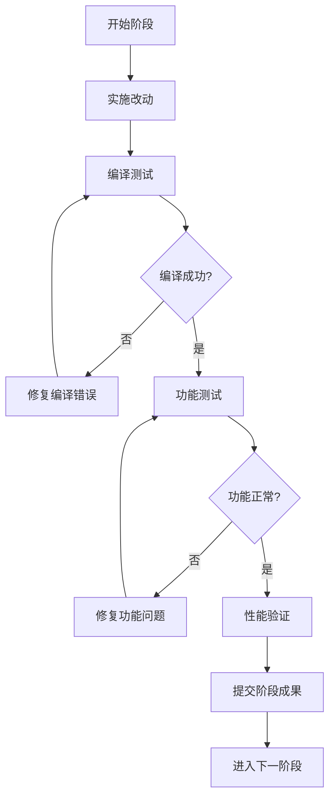

# Window.cpp 渐进式重构计划

## 重构策略

基于用户选择，采用渐进式重构方式，优先处理最关键的内存安全问题，确保每个阶段都可以独立验证和测试。

## 渐进式重构阶段

### 🚀 阶段1: 内存安全核心重构 (优先级: 最高)

**目标**: 消除内存泄漏风险，实现基本的内存安全

#### 1.1 智能指针替换 (必须完成)
- [ ] 将 `ShellSurface *m_shellSurface` 替换为 `std::unique_ptr<ShellSurface>`
- [ ] 将静态 `WaylandManager *s_waylandManager` 替换为 `std::unique_ptr<WaylandManager>`
- [ ] 更新所有相关的赋值和访问代码
- [ ] 移除手动 delete 调用

#### 1.2 RAII 基础实现 (必须完成)
- [ ] 确保所有资源在构造函数中获取，析构函数中自动释放
- [ ] 添加移动构造和移动赋值操作符
- [ ] 禁用拷贝构造和拷贝赋值（如果不需要）
- [ ] 实现异常安全的构造过程

#### 1.3 QPointer 应用 (必须完成)
- [ ] 对Qt对象指针使用 QPointer 进行安全监控
- [ ] 在访问Qt对象前检查指针有效性
- [ ] 更新事件过滤器中的指针访问

#### 1.4 验证测试 (必须完成)
- [ ] 编译测试确保无错误
- [ ] 功能测试验证基本操作正常
- [ ] 内存泄漏检测验证

### 🛠️ 阶段2: 错误处理和异常安全 (优先级: 高)

**目标**: 提升代码的健壮性和错误处理能力

#### 2.1 std::optional 应用
- [ ] 重构可能失败的函数返回 std::optional
- [ ] 更新调用方的错误检查逻辑
- [ ] 添加详细的错误日志记录

#### 2.2 异常安全保证
- [ ] 确保所有函数提供强异常安全保证
- [ ] 添加 noexcept 规范到适当的函数
- [ ] 实现异常安全的资源管理

#### 2.3 边界条件处理
- [ ] 添加空指针检查
- [ ] 处理Wayland协议未就绪的情况
- [ ] 添加超时和重试机制

### 🎯 阶段3: 现代C++特性应用 (优先级: 中)

**目标**: 利用现代C++特性提升代码质量

#### 3.1 auto 和类型推导
- [ ] 使用 auto 简化复杂类型声明
- [ ] 应用模板参数推导
- [ ] 使用 decltype 处理复杂返回类型

#### 3.2 lambda 表达式
- [ ] 用 lambda 替换简单的函数对象
- [ ] 优化信号槽连接中的回调
- [ ] 使用捕获列表优化闭包

#### 3.3 现代初始化
- [ ] 使用统一初始化语法
- [ ] 应用列表初始化
- [ ] 使用 in-place 构造

### ⚡ 阶段4: Qt最佳实践和性能优化 (优先级: 中低)

**目标**: 优化Qt代码和提升性能

#### 4.1 信号槽优化
- [ ] 更新为新式信号槽连接语法
- [ ] 使用 Qt::QueuedConnection 确保线程安全
- [ ] 优化连接的生命周期管理

#### 4.2 性能优化
- [ ] 减少不必要的对象拷贝
- [ ] 使用移动语义优化临时对象
- [ ] 优化字符串处理

#### 4.3 Qt对象管理
- [ ] 改进 parent-child 关系
- [ ] 优化对象的创建和销毁时机
- [ ] 使用 Qt 容器优化数据结构

### 🧹 阶段5: 代码结构优化 (优先级: 低)

**目标**: 提升代码可读性和可维护性

#### 5.1 函数重构
- [ ] 分解过长的函数
- [ ] 实现单一职责原则
- [ ] 改进函数命名和参数设计

#### 5.2 类设计优化
- [ ] 减少静态成员的使用
- [ ] 改进接口设计和封装
- [ ] 添加 const 正确性

#### 5.3 代码清理
- [ ] 移除死代码和注释代码
- [ ] 统一代码风格
- [ ] 添加必要的文档注释

## 实施策略

### 每阶段工作流程

### 验证标准
1. **编译标准**: 零警告、零错误
2. **功能标准**: 所有现有功能保持正常
3. **内存标准**: 无内存泄漏、无野指针访问
4. **性能标准**: 性能不降级

### 回退策略
- 每个阶段完成后创建git提交点
- 如果出现问题可以快速回退到稳定状态
- 保持原始代码备份

## 预期时间安排

- **阶段1**: 2-3小时（核心内存安全）
- **阶段2**: 1-2小时（错误处理）
- **阶段3**: 1-2小时（现代C++特性）
- **阶段4**: 1-2小时（Qt优化）
- **阶段5**: 1小时（代码清理）

**总计**: 6-10小时（可分多次完成）

## 成功标准

### 阶段1完成标准
- ✅ 无内存泄漏
- ✅ 智能指针完全替换裸指针
- ✅ RAII原则全面应用
- ✅ 编译和功能测试通过

### 最终完成标准
- ✅ 代码现代化程度显著提升
- ✅ 内存安全完全保障
- ✅ 异常安全得到改善
- ✅ 性能保持或提升
- ✅ 可维护性显著改善
