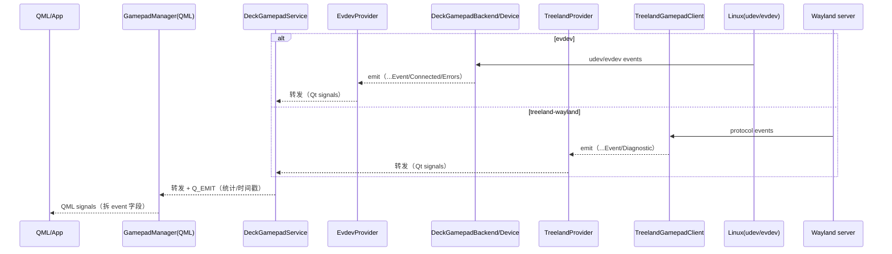

# 事件流/依赖图（lib/gamepad）

本文档优先提供**不依赖 Mermaid** 的纯文本版本，便于在终端/无图形渲染环境中阅读；文末保留 Mermaid 版本（可选）。

## 依赖图（纯文本）

```text
QML/App
  ^
  |  (Qt signals：QML 层对外暴露)
GamepadManager (lib/gamepad/qml)
  ^
  |  (Qt signals：面向上层的统一门面)
DeckGamepadService (lib/gamepad/src/service)
  ^
  |  (抽象接口：IDeckGamepadProvider)
  +------------------------------+
  |                              |
EvdevProvider                    TreelandProvider
(lib/gamepad/src/providers/evdev) (lib/gamepad/src/treeland)
  ^                              ^
  |                              |
DeckGamepadBackend/Device         TreelandGamepadClient(+Manager/Device)
(lib/gamepad/src/backend)        (lib/gamepad/src/treeland)
  ^                              ^
  |                              |
Linux udev + evdev                Wayland compositor（treeland-gamepad-v1）
```

## 时序图（纯文本）

图例：
- `->` 表示代码中显式 `emit/Q_EMIT`
- `=>` 表示 Qt signal→signal 的纯转发（通过 `connect(signal, signal)` 或等价方式）
- `~>` 表示通过 lambda 处理后再 `Q_EMIT`（例如更新统计/时间戳、拆字段等）

### evdev 链路（本地直连设备）

```text
Linux(udev/evdev)
  -> DeckGamepadDevice           : read(input_event) 并 emit buttonEvent/axisEvent/hatEvent
  => DeckGamepadBackend          : 转发 DeckGamepadDevice::*Event（Device -> Backend）
  => EvdevProvider               : 转发 DeckGamepadBackend::*Event（Backend -> Provider；backend 可在 IO 线程运行）
  ~> DeckGamepadService          : lambda 统计/时间戳 + Q_EMIT *Event
  ~> GamepadManager(QML)         : lambda 拆 event 结构体字段 + Q_EMIT *Event(基础类型)
  -> QML/App

（热插拔/可用性/错误同理）
  -> DeckGamepadBackend          : emit gamepadConnected/gamepadDisconnected/deviceAvailabilityChanged/lastErrorChanged/...
  => EvdevProvider               : 转发 + 名称映射（deviceErrorChanged -> deviceLastErrorChanged）
  => DeckGamepadService          : 转发（部分信号为直连转发，部分为 lambda 再 emit）
  -> GamepadManager(QML)         : 按需再发给 QML
  -> QML/App
```

### treeland-wayland 链路（应用连接 compositor）

```text
Wayland server
  -> TreelandGamepadDevice       : 协议回调后 emit buttonEvent/axisEvent/hatEvent（每个设备）
  ~> TreelandGamepadClient        : 汇总设备事件 + Q_EMIT *Event（带 deviceId）
  ~> TreelandProvider             : lambda + Q_EMIT *Event / gamepadConnected / deviceAvailabilityChanged / diagnosticChanged
  => DeckGamepadService           : 转发（部分信号为直连转发，部分为 lambda 再 emit）
  ~> GamepadManager(QML)          : lambda 拆 event 字段 + Q_EMIT *Event(基础类型)
  -> QML/App
```

## （可选）Mermaid 版本
```mermaid
graph TD; App[QML/App]-->GM[GamepadManager(QML)]-->S[DeckGamepadService]-->P[IDeckGamepadProvider]; P-->EU[EvdevProvider]-->B[DeckGamepadBackend/Device]-->OS[Linux udev+evdev]; P-->TP[TreelandProvider]-->TC[TreelandGamepadClient]-->WL[Wayland compositor];
```


## evdev/udev → Qt KeyEvent（从 input_event 到 QKeyEvent）

本节补充 **从 Linux udev/evdev 一直到 Qt Key Event** 的端到端调用/转发链路，聚焦 `DeckShellGamepad-private/` 当前实现。

### 1) udev：发现设备/热插拔 → 打开 `/dev/input/event*`

- 入口：`DeckGamepadBackend::start`（`src/backend/deckgamepadbackend.cpp`）
  - `udev_new()` 创建上下文
  - `udev_monitor_new_from_netlink(..., "udev")` + `udev_monitor_filter_add_match_subsystem_devtype(..., "input", ...)`
  - 将 udev monitor fd 交给 `QSocketNotifier`，触发时回调 `DeckGamepadBackend::handleUdevEvent`
  - 启动时 `probeGamepads()` 枚举当前存在的输入设备

- 热插拔：`DeckGamepadBackend::handleUdevEvent`（`src/backend/deckgamepadbackend.cpp`）
  - `action == "add"`：`isGamepadUdevDevice()` / `isGamepadDevice()` → `openGamepad()` → `tryOpenGamepad()`
  - `action == "remove"`：定位 `deviceId` 后 `closeGamepad()`，并清理 `knownDevices/devicePaths`、更新可用性

### 2) evdev：读 `struct input_event` → 抽象为 button/axis/hat 事件（Qt signals）

- 打开设备：`DeckGamepadBackend::tryOpenGamepad`（`src/backend/deckgamepadbackend.cpp`）
  - 通过 `DeviceAccessBroker`（或 fallback）打开 fd
  - 按 `runtimeConfig.grabMode` 可执行 `EVIOCGRAB`（Exclusive/Auto），用于“抓取”设备
  - 创建 `DeckGamepadDevice` 并 `openWithFd(fd, releaseDevice)`
  - 将 `DeckGamepadDevice::buttonEvent/axisEvent/hatEvent` **直连转发**到 `DeckGamepadBackend::*Event`（`connect(signal, signal)`）

- 读事件：`DeckGamepadDevice::processEvents`（`src/backend/deckgamepadbackend.cpp`）
  - `QSocketNotifier(m_fd)` 激活 → `read(m_fd, input_event[...])` 循环读到 `EAGAIN`
  - `EV_KEY` → 组装 `DeckGamepadButtonEvent`（`pressed/time_msec/button`）→ `emit buttonEvent(deviceId, event)`
  - `EV_ABS`
    - `ABS_HAT*` → 组装 `DeckGamepadHatEvent` → `emit hatEvent(...)`
    - 其他 axis → `normalizeAxisValue()`（deadzone/sensitivity/invert）→ `DeckGamepadAxisEvent` → `emit axisEvent(...)`
  - I/O 错误会 `closeForIoError()` 并 `emit disconnected(deviceId)`（由 backend 接住后向上转发）

### 3) Provider / Service：继续转发 + 统计/合并（仍是 Qt signals）

- Provider（evdev/udev 后端门面）：`EvdevProvider`
  - 主要工作是把 `DeckGamepadBackend` 的信号 **转发**到 `IDeckGamepadProvider` 信号（`src/providers/evdev/evdevprovider.cpp`；backend 可在 IO 线程运行）

- Service（上层统一入口）：`DeckGamepadService`
  - 在 `ensureProviderConnections()` 里把 provider 信号接进来（`src/service/deckgamepadservice.cpp`）
  - `buttonEvent`：lambda 里做计数/时间戳后 `Q_EMIT buttonEvent(...)`
  - `axisEvent/hatEvent`：可按 `runtimeConfig` 做 coalesce（合并）后再 `Q_EMIT`

### 4) QML：Service actionId（SSOT）→ Qt KeyEvent 注入

- `Gamepad`（`qml/gamepad.cpp`）
  - 订阅 `DeckGamepadService::*Event`，并按 `deviceId` 过滤
  - 更新内部状态并发出 `buttonChanged/axisChanged/hatChanged`（供 action mapper/业务层使用）

- `DeckGamepadService`（`src/service/deckgamepadservice.cpp`）
  - 维护每设备 `DeckGamepadActionMapper`（`ensureActionMapper(deviceId)`），并输出 `actionTriggered(deviceId, actionId, pressed, repeated)`
  - `handleHatAsVirtualDpadButtons()` 负责 hat→DPad 的 action 派生（避免 QML 再算一遍 actionId）

- `ServiceActionRouter`（`qml/serviceactionrouter.cpp`）
  - 只做桥接：监听 `DeckGamepadService::actionTriggered(deviceId, ...)` 并按 `gamepad.deviceId` 过滤
  - 输出统一的 QML 信号形态：`actionTriggered(actionId, pressed, repeated)`（不携带 deviceId）

- `GamepadKeyNavigation`（`qml/gamepadkeynavigation.cpp`）
  - 输入源：
    - 优先：`actionSource` / `actionRouter`（例如 `ServiceActionRouter` 或 legacy `GamepadActionRouter`）
    - 否则：默认直接订阅 `DeckGamepadService::actionTriggered(deviceId, ...)`（按 `gamepad.deviceId` 过滤）
    - 回滚：`useLegacyMapper=true` 时，才启用内置 `DeckGamepadActionMapper m_mapper` 消费 `Gamepad` 状态重新计算 actionId
  - `handleAction()`：`actionId` → `deckGamepadQtKeyMappingForActionId()`（`src/extras/deckgamepadactionkeymapping.*`）
  - 构造 `QKeyEvent(KeyPress/KeyRelease, qtKey, modifiers, ..., repeated)` 并 `QCoreApplication::sendEvent(target, &event)`
  - `target` 默认是 `focusObject` / `focusWindow`；且会基于 IME/文本输入/窗口 active 等进行 suppress，并在抑制时 `releaseAll()` 防止“卡键”

#### 4.0 `_deckGamepadService` 注入契约（注入/桥接）

当宿主进程希望**复用外部** `DeckGamepadService`（例如在更高层统一管理 provider/诊断/配置）时，应遵循以下可执行契约：

1) **注入时机（必须早于 QML 加载）**
- 在加载任何 `import DeckShell.DeckGamepad` 的 QML 之前设置：
  - `engine.rootContext()->setContextProperty("_deckGamepadService", serviceObject)`
- `serviceObject` 必须可 `qobject_cast<deckshell::deckgamepad::DeckGamepadService*>()` 成功（否则会被视为“未注入”）。

2) **单例创建入口（避免双实例/错过注入）**
- 所有 QML_SINGLETON（例如 `GamepadManager`/`GamepadConfigManager`）必须通过 QML 引擎的 singleton factory 创建：
  - 统一入口：`GamepadManager::create(engine, ...)`
- 避免在 QML 加载前调用 `GamepadManager::instance()` / `GamepadConfigManager::instance()` 等绕过引擎的入口，否则可能导致：
  - service 提前被内部创建，后续注入不生效
  - 同一进程出现“两个 service/两条事件链路”，表现为“看起来 supported=true，但事件/注入链路断开”

3) **失败提示（便于诊断注入时机问题）**
- 未注入时，`GamepadManager::create(...)` 会回退到内部 service，并打印 warning（用于定位“漏注入/注入太晚/类型不匹配”）。

#### 4.1 `actionId` 的 SSOT（现状链路 vs 目标链路）

> 以代码为准：actionId 的 SSOT 已统一到 `DeckGamepadService::actionTriggered(deviceId, actionId, ...)`（`src/service/deckgamepadservice.cpp` `DeckGamepadService::ensureProviderConnections/ensureActionMapper`）。QML 侧 KeyEvent 注入默认直接消费 Service actionId（经桥接过滤），不再二次计算 actionId。

**现状链路（当前代码，actionId SSOT 在 Service 侧产出）：**
1. Provider → `DeckGamepadService::ensureProviderConnections()` 处理 `buttonEvent/axisEvent/hatEvent`，通过 `ensureActionMapper(deviceId)` 生成 `actionTriggered(deviceId, actionId, pressed, repeated)`（同文件 `DeckGamepadService::handleHatAsVirtualDpadButtons` 负责 hat→DPad）
2. QML 侧：
   - `ServiceActionRouter` 按 `gamepad.deviceId` 过滤并输出 `actionTriggered(actionId, pressed, repeated)`，供 QML 消费；或
   - `GamepadKeyNavigation` 在未配置 `actionSource/actionRouter` 时，直接订阅 `DeckGamepadService::actionTriggered(deviceId, ...)`（同样按 `gamepad.deviceId` 过滤）
3. `GamepadKeyNavigation::handleAction` 进行门控/目标选择后注入 `QKeyEvent`（`deckGamepadQtKeyMappingForActionId` + `QCoreApplication::sendEvent`）

**legacy 回滚链路（保留一段时间用于回滚，默认不走）：**
1. `DeckGamepadService::*Event` → `qml/gamepad.cpp` `Gamepad::handle*Event`（更新状态并 `Q_EMIT buttonChanged/axisChanged/hatChanged`）
2. `GamepadKeyNavigation.useLegacyMapper=true` 或使用 `GamepadActionRouter`：
   - 通过 QML 内置 `DeckGamepadActionMapper` 重新计算 `actionTriggered(actionId, pressed, repeated)`
3. `GamepadKeyNavigation::handleAction` 注入 `QKeyEvent`

**删掉/合并点（减少层级/中转/格式转换）：**
- `GamepadKeyNavigation` 默认不再自带 action mapper，避免重复实现 repeat/priority/hat→DPad 等逻辑
- `GamepadActionRouter`（QML mapper）作为 legacy 路径保留，用于回滚/过渡

### 一句话总结（evdev/udev → Qt KeyEvent）

`Linux(udev monitor)` → `DeckGamepadBackend::handleUdevEvent` → `DeckGamepadBackend::tryOpenGamepad` → `DeckGamepadDevice::processEvents(read input_event)` → `DeckGamepadBackend signals` → `EvdevProvider signals` → `DeckGamepadService::actionTriggered(deviceId, actionId, ...)` → `ServiceActionRouter (optional)` → `GamepadKeyNavigation::handleAction` → `QKeyEvent` → `QCoreApplication::sendEvent(...)`

## 深挖补充：映射库与门控策略（gamecontrollerdb/udev/grab/action）

本节在上一节的“端到端链路”基础上，补齐四个更容易踩坑/需要落地策略的问题点：
1) `data/gamecontrollerdb.txt` 的作用与加载位置；  
2) udev 判定“是不是 gamepad”的规则；  
3) `EVIOCGRAB` / `SessionGate` 对“事件是否被系统/其他进程消费”的影响；  
4) `actionId → Qt::Key`、`GamepadButton/GamepadAxis → actionId` 的默认映射与可配置点。

### 0) `data/gamecontrollerdb.txt` 起什么作用？在哪一步被调用？

**作用（本质）：**`data/gamecontrollerdb.txt` 是 **SDL2 兼容格式**的 GameController DB（大量设备 GUID → 标准化按钮/轴语义映射）。它解决“不同手柄物理 evdev code/序号不一致”的问题，统一输出到库内的 `GamepadButton/GamepadAxis`（A/B/X/Y、L1/R1、LeftX/LeftY 等），从而让上层 action/导航逻辑保持稳定。

**运行时调用链路：**

- **安装/部署：**`src/CMakeLists.txt` 会将 `../data/gamecontrollerdb.txt` 安装到 `${CMAKE_INSTALL_DATADIR}/DeckShellGamepad/gamecontrollerdb.txt`（典型为 `/usr/share/DeckShellGamepad/gamecontrollerdb.txt`）。

- **加载时机：**`DeckGamepadBackend::start()` 调用 `reloadSdlDb(findDefaultSdlDatabase())`（`src/backend/deckgamepadbackend.cpp`）。

- **路径解析：**`findDefaultSdlDatabase()` → `DeckGamepadRuntimeConfig::resolveSdlDbPath()`（`src/core/deckgamepadruntimeconfig.h`），优先级如下：
  1. `DeckGamepadRuntimeConfig::sdlDbPathOverride`（文件存在才生效）
  2. 环境变量 `SDL_GAMECONTROLLERCONFIG_FILE`（文件存在才生效）
  3. `sdlDbSearchPaths` / 默认搜索路径（包含 `/usr/share/DeckShellGamepad/gamecontrollerdb.txt`，以及 legacy `DeckShell` 路径等）

- **加载实现：**`DeckGamepadSdlControllerDb::loadDatabase(dbPath)` 解析并缓存 GUID→mapping（`src/mapping/deckgamepadsdlcontrollerdb.cpp`）。

- **应用到设备：**设备打开后 `DeckGamepadDevice::setupDevice()` 会：
  - 通过 `DeckGamepadSdlControllerDb::extractGuid(devicePath, deviceName)` 生成 SDL GUID（`src/mapping/deckgamepadsdlcontrollerdb.cpp`）：
    - 优先使用 evdev 的 `input_id` 语义（`bustype/vendor/product/version`）构造（16-bit LE word + padding 的 SDL GUID 形式）
    - 在受限环境（部分 ioctl 被拒绝）下自动回退到 sysfs：`/sys/class/input/eventX/device/id/{bustype,vendor,product,version}`
    - udev properties/USB parent 信息仅作为兜底（best-effort）
  - `setupSdlMapping()`：若 DB 中存在该 GUID，则 `createDeviceMapping(guid, physicalButtonMap, physicalAxisMap)` 生成 `m_deviceMapping` 并用于 `mapButton/mapAxis`；否则回退到“通用硬编码映射”（`BTN_SOUTH/ABS_X/...`）。

**与自定义映射的关系（可配置点）：**

- `DeckGamepadCustomMappingManager` 支持把用户自定义映射（`custom_gamepad_mappings.txt`）解析为 `DeviceMapping`，再转换成 SDL mapping string，通过 `m_sdlDb->addMapping(...)` 注入 DB，最后让运行中设备 `reloadMapping()`（`src/mapping/deckgamepadcustommappingmanager.cpp`）。
- 结论：`gamecontrollerdb.txt` 是“默认映射基线”，`custom_gamepad_mappings.txt` 是“按 GUID 覆盖默认映射的用户层”，两者最终都走 SDL DB 的同一套解析/应用路径。

### 1) udev 判定“是不是 gamepad”的规则（以代码为准）

判定发生在两条路径：启动枚举 `probeGamepads()` 与热插拔 `handleUdevEvent()`（`src/backend/deckgamepadbackend.cpp`）。两者共同特征：
- 只枚举/监听 `subsystem=input`；
- 对 `devnode` 做过滤：`devpath` 包含 `/js` 的设备会被跳过（保留 `event*` 节点）。

**规则 A（优先，基于 udev properties）：**`isGamepadUdevDevice(dev)`
- `ID_INPUT_JOYSTICK == "1"` → 认为是 gamepad
- `ID_INPUT_GAMEPAD == "1"` → 认为是 gamepad

**规则 B（兜底，基于 evdev 能力位）：**`isGamepadDevice(devpath)`
- `EVIOCGBIT` 同时具备 `EV_KEY` 与 `EV_ABS`
- 且至少满足一组摇杆轴：`(ABS_X && ABS_Y) || (ABS_RX && ABS_RY)`

**隐含影响：**
- 规则 B 偏“宽松”：只要设备有 ABS 轴并满足一组 XY/RY 组合，就可能被纳入候选。
- 规则 A 依赖 udev 规则/数据库的准确性：不同发行版/不同设备的 `ID_INPUT_*` 可能缺失或不一致，因此库保留了规则 B 兜底。

### 2) `EVIOCGRAB` / `SessionGate` 对“事件是否被系统/其他进程消费”的影响

#### 2.1 `EVIOCGRAB`（设备抓取 / 独占采集）

发生位置：`DeckGamepadBackend::tryOpenGamepad()`（`src/backend/deckgamepadbackend.cpp`）。

- 由 `DeckGamepadRuntimeConfig::grabMode` 控制：
  - `Shared`（默认）：不抓取；同一设备节点可能同时被 compositor/Steam/SDL/其他进程读取，出现“系统也响应 + 我也响应”的双消费风险。
  - `Exclusive`：对打开的 fd 调用 `ioctl(fd, EVIOCGRAB, 1)`；抓取成功后，事件通常只会发给抓取方 fd（其他读取者将收不到该设备事件）。
  - `Auto`：当前实现上等价于“也要抓取”；抓取失败会按 I/O 错误处理并标记 Unavailable/进入重试逻辑（不是“抓不到就回退 Shared”）。

#### 2.2 `SessionGate`（Active session 门控）

发生位置：`DeckGamepadBackend::start()` 里连接 `SessionGate::activeChanged`，并在：
- `tryOpenGamepad()`：若 gate enabled 且 session inactive，会直接拒绝打开设备并设置错误上下文为 `SessionGate`。
- `handleSessionGateActiveChanged(false)`：对已连接设备执行关闭，标记 Unavailable，避免锁屏/切 VT/多会话下后台继续采集。
- `handleSessionGateActiveChanged(true)`：恢复时触发 `retryUnavailableDevices()` 尝试重新打开（退避由现有逻辑控制）。

实现细节：`SessionGate` 在构建时由 `DECKGAMEPAD_ENABLE_LOGIND` 决定是否启用 logind（需要 `Qt6::DBus`）。未构建 DBus 支持时，`supported=false` 且 `isActive()` 默认会保持 true，从而门控在运行时等价于“永远 active”。

### 3) `actionId → Qt::Key` 默认映射表与可配置点

默认映射表是**硬编码**的：`src/extras/deckgamepadactionkeymapping.cpp`

| actionId | 默认 Qt key |
|---|---|
| `nav.up` / `nav.down` / `nav.left` / `nav.right` | `Qt::Key_Up/Down/Left/Right` |
| `nav.accept` | `Qt::Key_Return` |
| `nav.back` | `Qt::Key_Escape` |
| `nav.menu` | `Qt::Key_Menu` |
| `nav.tab.next` / `nav.tab.prev` | `Qt::Key_Tab` / `Qt::Key_Backtab` |
| `nav.page.next` / `nav.page.prev` | `Qt::Key_Tab` / `Qt::Key_Backtab`（迁移期别名；语义按 Tab） |

调用位置：
- `qml/gamepadkeynavigation.cpp`：`GamepadKeyNavigation::handleAction()` 将 actionId 映射为 `QKeyEvent` 并 `QCoreApplication::sendEvent(target, &event)` 注入到 `focusObject/focusWindow`。
- `qml/gamepadactionkeymapper.cpp`：把 actionId 转成 `(qtKey, modifiers, pressed, repeated)` 的 QML 信号（用于上层自行处理）。

**可配置点（现状）：**
- C++ 层当前没有“从配置文件覆盖 actionId→key”的入口；若要自定义，通常在上层用 `actionId` 自行路由，或用 `GamepadActionKeyMapper` 获取 action 事件后自行映射成按键/业务动作。
- 与“键盘映射”相关但不同的一套能力在 `extras/deckgamepadkeyboardmapping.*` 与 `extras/keyboardmappingprofile.*`：它们提供 `GamepadButton/GamepadAxis → Qt key` 的可持久化映射（JSON），并通过 `keyEvent(...)` 信号输出（不负责注入）。

### 4) `GamepadButton/GamepadAxis → actionId`：默认映射与可配置方案

#### 4.1 默认映射（当前实现）

`DeckGamepadActionMapper`（`src/extras/deckgamepadactionmapper.cpp`）把 `GamepadButton/GamepadAxis` 映射成稳定 actionId：

- DPad：`GAMEPAD_BUTTON_DPAD_*` → `nav.up/down/left/right`
- A/B：`GAMEPAD_BUTTON_A/B` → `nav.accept` / `nav.back`
- Start：`GAMEPAD_BUTTON_START` → `nav.menu`
- L1/R1：`GAMEPAD_BUTTON_L1/R1` → `nav.tab.prev` / `nav.tab.next`
- Left stick：`GAMEPAD_AXIS_LEFT_X/Y` 通过 `deadzone/hysteresis/diagonalPolicy/releaseOnCenter` 判定方向 → `nav.*`（并可对方向动作输出 repeat）

注意：当前 action mapper 只覆盖“导航动作”这一小撮；trigger/right stick/更多按钮（X/Y/L2/R2/Guide 等）不会自动变成 actionId（除非上层自己扩展或新增 mapper）。

#### 4.2 已有的“间接可配置”方式（不改 action mapper 源码）

虽然 action mapper 的逻辑按钮集合是固定的，但“物理输入→逻辑 `GamepadButton/GamepadAxis`”这一步是可配的：

- `gamecontrollerdb.txt`（默认基线）决定某设备 GUID 的标准按钮/轴语义
- `custom_gamepad_mappings.txt`（`DeckGamepadCustomMappingManager`）可对单设备 GUID 覆盖按钮/轴映射并热应用

因此：通过把物理按键重新映射为逻辑 `GAMEPAD_BUTTON_A/B/L1/R1/DPAD_*` 等，可以**间接改变**触发哪些 `nav.*` action。

#### 4.3 已实现：Action Mapping Profile（直接可配置）

为产品化 action 层，本仓库已引入 **Action Mapping Profile**（JSON），用于把“标准化输入（`GamepadButton/GamepadAxis`）→ 稳定 actionId（press/release/repeat）”作为可配置能力（不再依赖改 SDL DB 来“间接”实现动作绑定）。

**实现位置**
- Profile 解析与默认 preset：`src/extras/actionmappingprofile.{h,cpp}`
- Mapper 应用 profile：`src/extras/deckgamepadactionmapper.{h,cpp}`
- Service 下沉输出 actionId：`src/service/deckgamepadservice.{h,cpp}`

**接入点（已实现：C++ 层）**
- `DeckGamepadRuntimeConfig::actionMappingProfilePathOverride` + `resolveActionMappingProfilePath()`
  - profile 文件名约定：`action_mapping_profile.json`
  - profile 仅在文件存在时加载；未配置/不存在时回退默认 preset（与 `DeckGamepadActionMapper::applyNavigationPreset()` 一致）
- `DeckGamepadService::start()` 阶段加载 profile，并对每个 `deviceId` 维护独立 mapper，向上层发出稳定 actionId 事件：
  - `actionEvent(int deviceId, DeckGamepadActionEvent event)`
  - `actionTriggered(int deviceId, QString actionId, bool pressed, bool repeated)`
  - `hatEvent(hat=0)` 会被转换为虚拟 DPad buttons（`GAMEPAD_BUTTON_DPAD_*`），确保 hat-based DPad 也能产出 `nav.*`。

**Profile JSON 结构（v1.0）**
- `navigation_priority`（可选）：
  - `dpad_over_left_stick`（默认）
  - `left_stick_over_dpad`
- `repeat`（可选，仅用于“方向动作”）：`{ enabled, delay_ms, interval_ms }`
- `button_bindings`：`{ "<GamepadButton int>": "<actionId>" }`
  - 空字符串表示显式解绑（覆盖默认 preset）
- `axis_bindings`：`{ "<GamepadAxis int>": { negative?, positive?, threshold? } }`
  - `negative/positive` 为 actionId 字符串；`threshold` 为 (0.0 - 1.0)

示例：
```json
{
  "version": "1.0",
  "navigation_priority": "left_stick_over_dpad",
  "repeat": { "enabled": true, "delay_ms": 350, "interval_ms": 80 },
  "button_bindings": {
    "0": "nav.accept",
    "9": "nav.menu"
  },
  "axis_bindings": {
    "0": { "negative": "nav.left", "positive": "nav.right", "threshold": 0.25 },
    "1": { "negative": "nav.up", "positive": "nav.down", "threshold": 0.25 }
  }
}
```

**与 `gamecontrollerdb/custom_gamepad_mappings` 的分工**
- SDL DB/自定义映射：解决“物理设备差异 → 标准化 `GamepadButton/GamepadAxis`”
- Action mapping profile：解决“标准化输入 → 上层动作语义（nav/ui/…）”

### 5) treeland-wayland → Qt KeyEvent：注入/转发链路与关键差异

`treeland-wayland` 分支的 **Qt KeyEvent 注入点** 与本地 `evdev` 分支是一致的（最终仍由 `qml/gamepadkeynavigation.cpp` 构造 `QKeyEvent` 并 `QCoreApplication::sendEvent(...)`）。差异主要在于 **“事件源头如何进入 DeckGamepadService”** 以及 **门控/权限/映射能力的归属**。

#### 5.1 事件源头：Wayland 协议回调，而非 `/dev/input`

核心链路（从 compositor 到库内事件）：

1. `TreelandProvider::start()` → `TreelandGamepadClient::connectToCompositor()`（`src/treeland/treelandprovider.cpp` / `src/treeland/treelandgamepadclient.cpp`）
   - 连接 `wl_display`，从 registry 绑定 `treeland_gamepad_manager_v1`
   - 用 `wl_display_get_fd()` 拿到 Wayland fd，并用 `QSocketNotifier` 接入 Qt event loop

2. Wayland fd 可读 → `TreelandGamepadClient::handleWaylandEvents()`（`src/treeland/treelandgamepadclient.cpp`）
   - `wl_display_prepare_read/flush/read_events/dispatch_pending` 分发协议事件

3. 协议事件回调 → `TreelandGamepadManager` listeners（`src/treeland/treelandgamepadmanager.cpp`）
   - `gamepad_added`/`gamepad_removed`：创建/销毁 `treeland_gamepad_v1` 对象
   - `button/axis/hat/device_info`：回调到 `TreelandGamepadDevice::handleButton/handleAxis/handleHat/setGuid`

4. `TreelandGamepadDevice` 发出 `DeckGamepadButtonEvent/AxisEvent/HatEvent`（`src/treeland/treelandgamepaddevice.cpp`）
   - 注意：协议侧传来的 `button/axis` 约定为 **deckgamepad 的枚举序号**（`GamepadButton/GamepadAxis`），库侧不再做 SDL DB 映射。

5. `TreelandProvider` 将 client 的事件信号转发到 `IDeckGamepadProvider`，再被 `DeckGamepadService` 统一接入（`src/treeland/treelandprovider.cpp` / `src/service/deckgamepadservice.cpp`）

之后到 QML 与 KeyEvent 的路径与本地 `evdev` 分支一致：
`DeckGamepadService::actionTriggered(deviceId, actionId, ...)`（SSOT） → `ServiceActionRouter`（可选） → `GamepadKeyNavigation::handleAction()` → `QKeyEvent` 注入。

#### 5.2 门控与“收不到事件”的差异：focused gating vs SessionGate/EVIOCGRAB

- `evdev`（本地 `/dev/input` 分支；可 IO 线程化，亦可启用单线程调试模式）：
  - 你能否收到事件，取决于你是否能打开 `/dev/input/event*`（权限/占用），以及是否启用 `EVIOCGRAB`（独占/共享）。
  - `SessionGate`（logind）用于“active session 才采集”的门控（锁屏/切 VT/多会话时自动停采并恢复）。

- `treeland-wayland`：
  - 你是否收到事件，首先取决于 compositor 的协议策略：默认存在 **focused gating**（仅向键盘焦点所属客户端发送事件）。
  - `TreelandGamepadClient` 内置了“发现设备但未收到事件”的诊断提示，并通过 `TreelandProvider` 转换为结构化诊断：
    - `DeckGamepadDiagnosticKey::WaylandFocusGated`（`deckgamepad.wayland.focus_gated`）
    - `suggestedActions`：`help.focus_window` / `help.request_authorization`
  - `EVIOCGRAB` 与 `/dev/input` 的“多进程抢读”问题在此分支通常不再由 client 处理：设备采集由 compositor 完成，client 只是接收协议转发的事件。

> 提示：即便 treeland 侧通过授权支持“后台收事件”（listen_background），`GamepadKeyNavigation` 仍会在窗口非 active、IME 可见、TextInput 聚焦等情况下 suppress KeyEvent 注入；需要后台处理时更推荐消费 `DeckGamepadService` 的事件/或 actionId，而不是依赖 KeyEvent 注入。

#### 5.3 映射/可配置能力归属差异：SDL DB vs compositor

- `evdev`（本地 `/dev/input` 分支；可 IO 线程化，亦可启用单线程调试模式）：
  - 设备差异由库内 `gamecontrollerdb.txt` + `custom_gamepad_mappings.txt`（`DeckGamepadCustomMappingManager`）解决；
  - axis 的归一化与自定义 deadzone/sensitivity 发生在设备读事件链路（`DeckGamepadDevice::normalizeAxisValue` + 运行期设置）。

- `treeland-wayland`：
  - 设备映射（button/axis 编号、guid、振动能力等）由 compositor/协议提供；库侧不加载/应用 SDL DB 到该分支的事件解码。
  - `TreelandProvider::customMappingManager()` / `calibrationStore()` 返回 `nullptr`（即该 provider 不提供本地自定义映射/校准存储）。
  - deadzone 通过协议 `set_axis_deadzone`（v2）在 compositor 侧配置，且可能需要授权能力（`write_deadzone`）；`setAxisSensitivity` 明确为 NotSupported。

#### 5.4 treeland 授权/能力（authorize(token)）在上层如何调用与落地

`treeland_gamepad_manager_v1` 协议（v2）提供 `authorize(token)` 请求，用于向 compositor 申请“特权能力”（capabilities）。能力是 **按 Wayland 连接生命周期生效** 的：一旦连接断开，需要重新授权。

协议定义（见 `protocols/treeland-gamepad-v1.xml`）：

- `listen_background (0x1)`：允许 **窗口未获得键盘焦点** 时仍接收 gamepad 输入事件（绕开 focused gating）。
- `vibrate_background (0x2)`：允许 **窗口未获得键盘焦点** 时仍能请求振动（是否执行由 compositor 决定）。
- `write_deadzone (0x4)`：允许修改 compositor 的 deadzone（影响全局语义，通常属于敏感能力）。

本仓库代码中 capability 的使用现状：

- 授权入口在 `TreelandGamepadClient::authorize(token)`（`src/treeland/treelandgamepadclient.cpp`），内部会调用 `treeland_gamepad_manager_v1_authorize(...)` 并 `wl_display_flush(...)`。
- 授权结果通过 `TreelandGamepadClient::authorized(uint32_t capabilities)` / `authorizationFailed(uint32_t error)` 信号返回，同时更新 `grantedCapabilities` 属性（`src/treeland/treelandgamepadclient.h`）。
- `write_deadzone` 在 `TreelandProvider::setAxisDeadzone()` 里被强制检查（`hasCapability(0x4 /* write_deadzone */)`），缺失则直接返回 `PermissionDenied`（`src/treeland/treelandprovider.cpp`）。
- `listen_background/vibrate_background` 当前未在 provider 层显式检查，但协议侧可能会基于能力决定是否转发事件/执行振动请求（因此上层应按授权状态做 UX 引导）。

上层落地建议（调用时序与交互）：

1. **何时需要授权**
   - 当上层看到诊断 `deckgamepad.wayland.focus_gated`（无事件且提示 focused gating）并确实需要后台收事件（校准/诊断/overlay 模式）时，申请 `listen_background`。
   - 当需要调用 `setAxisDeadzone`（全局 deadzone 调参）时，申请 `write_deadzone`（建议仅在“设置/校准”入口暴露，并明确提示影响范围）。
   - 当需要在 unfocused 场景也能震动时，申请 `vibrate_background`（视 compositor 策略）。

2. **token 从哪里来**
   - 协议文档约定 token 由 compositor 侧发放（例如 system D-Bus + polkit）。本仓库 **不包含** token 获取实现；上层应用/系统组件需自行提供“申请 token”的接口与 UI 授权流程。

3. **如何调用 authorize(token)（上层调用路径）**
   - C++ 上层：持有 `TreelandGamepadClient` 实例时，直接调用 `authorize(token)`，并监听 `authorized/authorizationFailed`。
   - QML/应用侧（现状）：`TreelandProvider` 未对外暴露 `authorize(token)`，因此若需要在 QML 里发起授权，应在上层工程中：
     - 为 QML 层增加一个“授权桥接”（例如在 `GamepadManager` 或应用侧 service wrapper 上增加 `authorizeTreeland(token)`），内部转调到 `TreelandGamepadClient::authorize`；或
     - 在 C++ 上层完成授权流程后，仅把授权后的状态（`grantedCapabilities`、错误原因）通过现有的 diagnostic/suggestedActions 通道反馈到 QML。

4. **如何处理授权失败（authorization_failed）**
   - 协议错误码：`invalid_token(1)` / `expired_token(2)` / `credential_mismatch(3)`（`protocols/treeland-gamepad-v1.xml`）。
   - 建议上层将其转换为用户可操作的提示（重新申请 token / 检查当前用户/会话 / 重试）。

5. **与 Qt KeyEvent 注入的关系（一个常见误区）**
   - `listen_background` 能让 treeland 协议“在 unfocused 也发输入事件”，但 `qml/gamepadkeynavigation.cpp` 仍可能因为窗口非 active、IME 可见、TextInput 聚焦等原因 suppress KeyEvent 注入。
   - 因此后台/服务型逻辑建议直接消费 `DeckGamepadService` 的事件或 actionId，而不是依赖 KeyEvent 注入。

#### 5.5 推荐的上层 API 形态（面向 QML：authorize + capability + 失败原因）

当前 `TreelandProvider`/`DeckGamepadService` 并未对 QML 直接暴露 `authorize(token)`；若上层希望在 UI 中完成授权闭环，建议提供一个“授权桥接 API”（以 `GamepadManager` 为例）：

- **方法：**
  - `Q_INVOKABLE bool authorizeTreeland(const QString &token)`
    - 语义：向当前 treeland Wayland 连接提交 token，触发协议 `authorize(token)`。
    - 返回值：表示“请求是否成功发出”（不等价于授权成功；成功/失败需看后续信号）。

- **属性：**
  - `Q_PROPERTY(uint32_t treelandGrantedCapabilities READ ... NOTIFY treelandGrantedCapabilitiesChanged)`
    - 透出 `TreelandGamepadClient::grantedCapabilities`（bitfield）。
  - `Q_PROPERTY(int treelandAuthorizationError READ ... NOTIFY treelandAuthorizationErrorChanged)`
    - 透出协议 `authorization_failed.error`（`invalid_token/expired_token/credential_mismatch`）。
  - `Q_PROPERTY(QString treelandAuthorizationErrorText READ ... NOTIFY treelandAuthorizationErrorChanged)`
    - 把 error code 解释为可展示文本（用于 UI）。

- **信号：**
  - `void treelandAuthorized(uint32_t capabilities);`
  - `void treelandAuthorizationFailed(int errorCode);`

**推荐的数据流（QML 侧）：**

1. QML 观察 `GamepadManager.diagnosticKey/suggestedActions`（已存在），当出现 `help.request_authorization` 时展示授权入口；
2. 用户完成系统授权流程（上层实现）拿到 token；
3. QML 调用 `GamepadManager.authorizeTreeland(token)`；
4. 监听 `treelandAuthorized/treelandAuthorizationFailed` 与 `treelandGrantedCapabilities`，据此刷新 UI：
   - 若已拿到 `listen_background`：可提示“已支持后台收事件”；
   - 若缺少 `write_deadzone`：在 deadzone UI 上显示“需要授权”并给出引导；
   - 若失败：提示“token 失效/过期/不匹配”，并引导重新获取 token。

> 说明：如果你希望将授权能力“上收”到更通用的 `DeckGamepadService`（而不是 GamepadManager），也可在上层工程提供 service wrapper；核心是把 `authorize(token)` 与 `grantedCapabilities/失败原因` 作为可观察状态暴露到 UI。

#### 5.6 `deckgamepad.wayland.not_authorized`：触发点梳理（现状与建议）

`deckgamepad.wayland.not_authorized`（`DeckGamepadDiagnosticKey::WaylandNotAuthorized`）目前已在：
- `src/core/deckgamepaddiagnostic.h` 定义；
- QML `GamepadManager` 的 `diagnosticKindFromDiagnosticKey()` 中被识别为 Denied（`qml/gamepadmanager.cpp`）。

但在当前实现里，这个 diagnostic key **尚未被任何 provider 实际发出**。现状与建议触发点如下：

**现状（已实现但不使用该 key）：**
- focused gating 场景：`TreelandGamepadClient` 会在“发现设备但未收到事件”时输出一段诊断文本；`TreelandProvider` 将其转换为
  - key：`deckgamepad.wayland.focus_gated`
  - suggestedActions：`help.focus_window` / `help.request_authorization`
- deadzone 未授权：`TreelandProvider::setAxisDeadzone()` 会在缺少 `write_deadzone` capability 时直接返回 `PermissionDenied` 错误（error context: `TreelandProvider::setAxisDeadzone`），并通过 `hint` 引导用户申请 token；但不会发出 `deckgamepad.wayland.not_authorized`。

**建议的 diagnostic 触发点（用于补齐 `deckgamepad.wayland.not_authorized`）：**
1. **authorize(token) 失败：**
   - 触发源：协议事件 `treeland_gamepad_manager_v1.authorization_failed(error)`（见 `protocols/treeland-gamepad-v1.xml`）
   - 建议转换为：
     - key：`deckgamepad.wayland.not_authorized`
     - details：`error`（`invalid_token/expired_token/credential_mismatch`）+（可选）“需重新申请 token”
     - suggestedActions：`help.request_authorization` / `help.retry`
2. **需要特权能力但缺失：**
   - 触发源：例如调用 `set_axis_deadzone` 时缺少 `write_deadzone`（或需要后台收事件但缺少 `listen_background`）
   - 建议转换为：
     - key：`deckgamepad.wayland.not_authorized`
     - details：`missing_capability`（如 `write_deadzone`）
     - suggestedActions：`help.request_authorization`

> 区分建议：`focus_gated` 表示“因焦点门控收不到事件（可通过聚焦或申请后台监听解决）”；`not_authorized` 表示“已明确缺少权限/能力（需要授权）”。两者可并存，但 key 应尽量反映“最具体、可操作”的原因。

#### 5.7 compositor 协议事件 → Service actionId → Qt KeyEvent 注入（逐步链路对照）

本小节把 `5.1` 的“协议事件源”与 `DeckGamepadService` 的 action 下沉（`src/service/deckgamepadservice.cpp`）串起来，给出从 compositor 到 KeyEvent 注入的可追踪链路，并对照 KeyEvent 注入的现状/目标。

1) 协议事件回调 → `TreelandGamepadManager` listener → `TreelandGamepadDevice::handle*`
   - 协议回调落点：`src/treeland/treelandgamepadmanager.cpp` `TreelandGamepadManager::handleButton/handleAxis/handleHat`
   - 设备落地：`src/treeland/treelandgamepaddevice.cpp` `TreelandGamepadDevice::handleButton/handleAxis/handleHat`
   - 输出事件结构（关键字段）：
     - `DeckGamepadButtonEvent { time_msec, button, pressed }`
     - `DeckGamepadAxisEvent { time_msec, axis, value }`
     - `DeckGamepadHatEvent { time_msec, hat, value }`

2) `TreelandGamepadDevice` → `TreelandGamepadClient` 聚合并补 `deviceId`
   - 连接与聚合：`src/treeland/treelandgamepadclient.cpp` `TreelandGamepadClient::handleGamepadAdded`
   - 关键行为：把每个 device 的 `buttonEvent/axisEvent/hatEvent` 转成 client 的 `buttonEvent/axisEvent/hatEvent(int deviceId, ...Event)` 并统计 `totalEventCount`（用于 focused gating 诊断判定）

3) Client → Provider → Service（事件接入点一致）
   - Provider 转发：`src/treeland/treelandprovider.cpp` `TreelandProvider::TreelandProvider`（连接 client 信号并 `Q_EMIT` provider 同名事件）
   - Service 接入：`src/service/deckgamepadservice.cpp` `DeckGamepadService::ensureProviderConnections`

4) Service：事件 → actionId（SSOT）
   - `DeckGamepadService::ensureProviderConnections` 在收到 `buttonEvent/axisEvent/hatEvent` 时调用 `ensureActionMapper(deviceId)` 并 `processButton/processAxis`
   - hat→DPad：`DeckGamepadService::handleHatAsVirtualDpadButtons` 将 `hat=0` 派生为虚拟 `GAMEPAD_BUTTON_DPAD_*` 再喂给 mapper
   - action 输出：`DeckGamepadService::ensureActionMapper` 连接 `DeckGamepadActionMapper::actionTriggered` 并 `Q_EMIT actionTriggered(deviceId, actionId, pressed, repeated)`

5) KeyEvent 注入（现状 vs 目标）
   - 现状：`qml/gamepadkeynavigation.cpp` `GamepadKeyNavigation::updateSubscriptions` 并不监听 `DeckGamepadService::actionTriggered`，而是监听 `GamepadActionRouter::actionTriggered`（`qml/gamepadactionrouter.cpp` 内置 mapper），最终在 `GamepadKeyNavigation::handleAction` 构造 `QKeyEvent` 并 `QCoreApplication::sendEvent(...)`
   - 目标：QML 直接消费 `DeckGamepadService::actionTriggered` 注入 KeyEvent；“现状链路 vs 目标链路”的详细对照见 `### 4) QML` 的 `4.1` 小节
